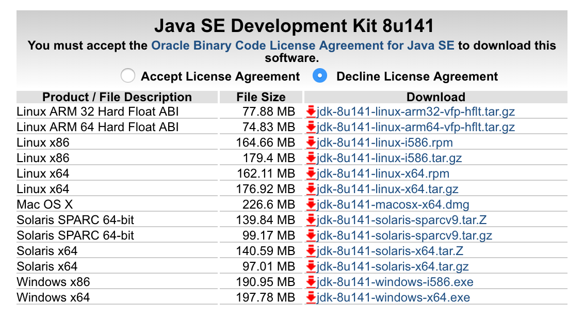

* Cài đặt môi trường làm việc
* Công cụ lập trình Java
* Biên dịch & chạy Java trên dòng lệnh
* Làm quen với syntax của Java

## 1. Cài đặt môi trường làm việc

### 1.1 Tổ chức thư mục làm việc

* Tạo thư mục gốc *java* dưới thư mục HOME
* Tạo thư mục *TechMaster* trong *java*
* Tạo thư mục *java-course* trong *TechMaster*
* Tạo thư mục *session1* trong *java-course*

```shell
cd ~
mkdir java
```

```shell
cd java
mkdir TechMaster
cd TechMaster
```

__Bài tập 1:__

*Mỗi học viên tạo thư mục làm việc theo mô tả trong mục 1.1 từ terminal của Linux/Mac*

### 1.2 Cài đặt JDK

Tải JDK (viết tắt của Java Development Kit) từ link sau

http://www.oracle.com/technetwork/java/javase/downloads/jdk8-downloads-2133151.html




*Linux*

```shell

```

*Mac OS*

```shell
```


__Bài tập 2:__

*Cài đặt phiên bản JDKs tương ứng với hệ điều hành trên máy của học viên và kiểm tra cài đặt thành công bằng câu lệnh*

```shell
java -version
```

## 2. Công cụ lập trình Java


* Eclipse
* NetBean
* IntelliJ
* JCreator
* Sublime
* Vim
* Text editor bất kỳ


__Chú ý:__

*Trong 4 buổi học đầu tiên, học viên được yêu cầu sử dụng text editor đơn giản để lập trình*


## 3. Biên dịch & chạy Java trên dòng lệnh

### 3.1 HelloWorld

__Bài tập 3:__

*Học viên dùng text editor (Vim,Gedit,...) và tạo file HelloWorld.java nằm trong thư mục session1 với nội dung như dưới đây. Sau đó chạy các command javac/java trên terminal theo hướng dẫn*

```java
public class HelloWorld{

  public static void main(String[] args){
     System.out.println("Hello World");
  }
}
```

```shell
javac HelloWorld.java
java HelloWorld
```

__Bài tập 4:__

*Thêm các đoạn mã in ra màn hình tên, tuổi, nghề nghiệp của học viên*

### 3.2 *javac* & *java*

Java là ngôn ngữ *biên dịch* (compiled programming language), với *mã nguồn* (source code) là các file có đuôi *.java*. Việc chạ một chương trình Java từ file *mã nguồn* đầu vào gồm 2 giai đoạn chính:

* Compile: *javac* (viết tắt của Java Compiler) tạo ra file *.class* từ các file *mã nguồn*
* Run: *java* nhận đầu vào là file *.class* có chứa method *main* và thực thi các lệnh trong hàm *main*

__Chú ý:__

*Một chương trình Java bất kỳ dù đơn giản hay phức tạp với cả 1.000.000 dòng code thì cũng đều xuất phát với một file *.class* có chứa hàm *main**

```java
public static void main(String[] args){
...
}
```

### 3.3 Tên & cấu trúc file *.java*

* Tên file mã nguồn Java được quy ước luôn bắt đầu bằng chữ cái in hoa. Ví dụ: *Bird.java, Tube.java, Game.java,...*
* Mỗi file mã nguồn *FILE_NAME.java* sẽ luôn có cấu trúc sau đây (*)

```java
public class FILE_NAME{


}
```

__Chú ý:__

*Khẳng định (\*) không hoàn toàn đúng (học viên sẽ nhận thấy điều này trong các buổi học sau). Tuy nhiên, ta chấp nhận khẳng định này trong các buổi học đầu của khoá học*

### 3.3 Hàm *main*

```java
public class FILE_NAME{

  public static void main(String[] args){

  }

}
```

Mỗi file mã nguồn Java có thể chứa hoặc không chứa hàm *main*

* File có chứa hàm *main* chạy được với câu lệnh *java FILE_NAME*
* File không chứa hàm *main* KHÔNG chạy được với câu lệnh *java FILE_NAME*

__Bài tập 5:__

*Comment hàm main trong HelloWorld.java, sau đó biên dịch và chạy lại HelloWorld từ terminal và xem kết quả trên màn hình console*

## 4. Làm quen với syntax cơ bản của Java

### 4.1 String & int

### 4.2 Khai báo biến

### 4.3 Vòng lặp *for*

### 4.4 *if* & *else*


