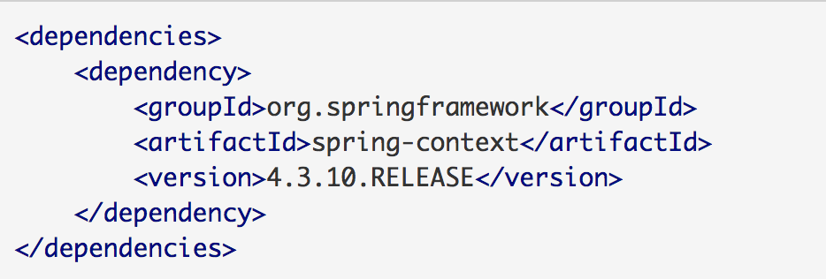
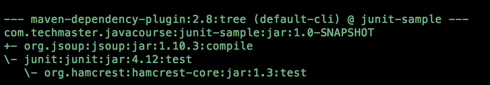
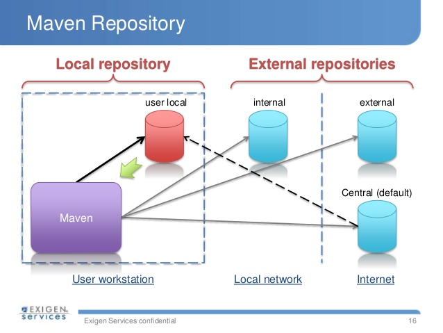
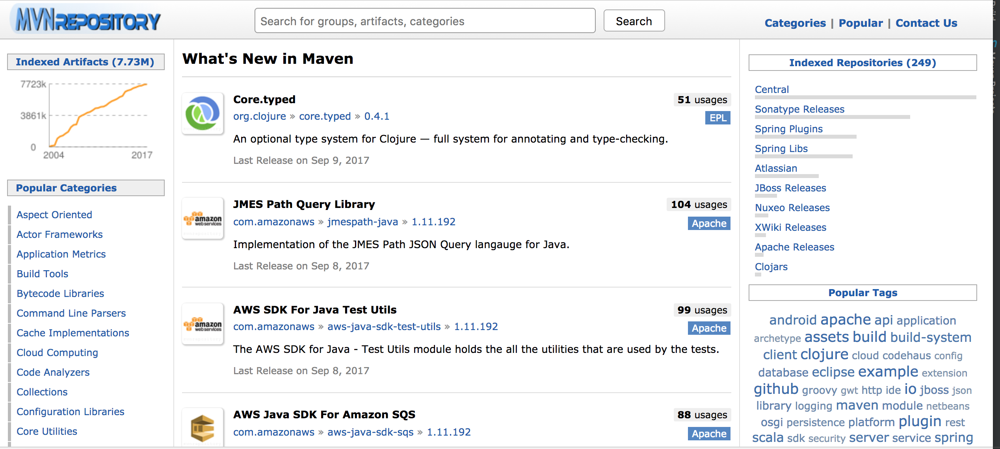
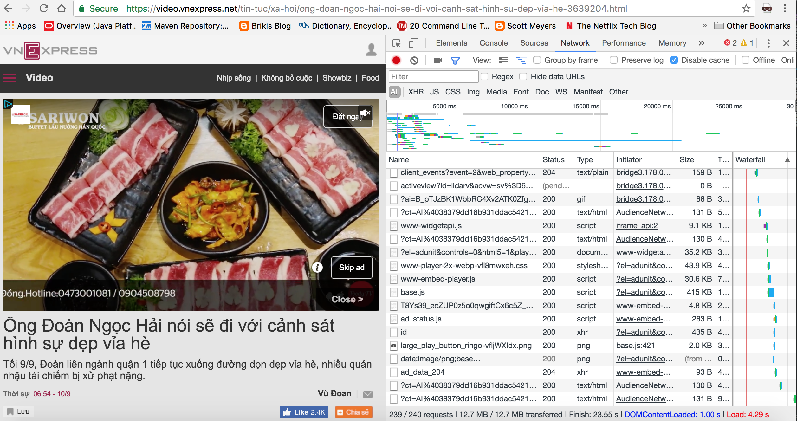

* Maven Dependencies Management
* Debug JUnit
* Ứng dụng *vscraper*

## 1. Maven Dependencies Management



Một trong những tính năng quan trọng nhất của Maven là quản lý *dependencies* của project.

Cụ thể hơn là trong quá trình build project thì Maven sẽ đảm bảo các third-party dependencies sau đây được lấy về đầy đủ:

* Libraries khai báo trực tiếp trong pom.xml
* Libraries là dependency của các libraries được khai báo trong pom.xml

### 1.1. *dependency* command



Maven cung cấp một số command cho phép hiển thị thông tin các *dependencies* và *nested dependencies* của project

```shell
mvn dependency:tree
mvn dependency:analyze
```

__Bài tập 1:__

*Chạy lần lượt các command trên với project **junit-sample** tạo trong buổi học trước*

### 1.2. Maven *artifact*

Maven sử dụng thuật ngữ *artifact* cho các dependencies của project

```xml
        <dependency>
            <groupId>org.jsoup</groupId>
            <artifactId>jsoup</artifactId>
            <version>1.10.3</version>
        </dependency>

```

Mỗi artifact sẽ được định danh bởi các tham số sau:

* *groupId*
* *artifactId*
* *version*

### 1.3. Maven Repository



Như đã thấy trong buổi học trước, trong quá trình build project, Maven sẽ tải các *artifact* về thư mục *~/.m2/repository*, cụ thể hơn:

* Nếu *artifact* (ví dụ: jsoup 1.10.3) chưa tồn tại trong *~/.m2/repository* thì Maven sẽ download artifact cũng như các dependencies về *~/.m2/repository*
* Nếu *artifact* đã tồn tại trong *~/.m2/repository* thì Maven sử dụng file *.jar* tương ứng ở local cho quá trình biên dịch, chạy chương trình

Khái niệm *repository* trong Maven có nghĩa là nơi lưu trữ các *artifact*. Có 2 loại *repository* là *local* và *remote*

*Local repository*

Thư mục bất kỳ trên môi trường local để lưu trữ các *artifact* được tải về. Thư mục mặc định Maven sử dụng cho *local repository* là *~/.m2/repository*

*Remote repository*

Public website cho phép tải về các *artifact* cần cho project. Ví dụ:

* https://repo.maven.apache.org/maven2/
* http://mvnrepository.com/



## 2. Debug JUnit

Maven hỗ trợ việc debug unit test trong quá trình phát triển unit test thông qua command sau

```shell
mvn clean test -Dmaven.surefire.debug
```
__Bài tập 2:__

*Debug các unit test trong class HtmlParserTest trong bài tập ở buổi học trước*

## 3. Ứng dụng *vscraper*


Học viên được yêu cầu phát triển ứng dụng *vscraper*, cho phép lấy dữ liệu tự động từ một số websites.

Về cơ bản, việc lấy dữ liệu từ website có thể tách ra làm 2 *phase* chính sau:

* Lấy dữ liệu thô dưới định dạng HTML
* Bóc tách các dữ liệu cần thiết từ dữ liệu thô

Có 2 phương pháp chính để lấy dữ liệu thô từ website:

1. Sử dụng HTTP client library như Apache HTTP Client
2. Sử dụng thư viện giả lập thao tác người dùng trên trình duyệt như Selenium.

Các third-party libraries được dùng trong ứng dụng *vscraper*

1. Apache HTTP Client:

https://hc.apache.org/httpcomponents-client-ga/

2. Selenium:

http://www.seleniumhq.org/projects/webdriver/

3. JSoup:

https://jsoup.org/


### 3.1. Tạo Maven project

```xml
<?xml version="1.0" encoding="UTF-8"?>
<project xmlns="http://maven.apache.org/POM/4.0.0"
         xmlns:xsi="http://www.w3.org/2001/XMLSchema-instance"
         xsi:schemaLocation="http://maven.apache.org/POM/4.0.0 http://maven.apache.org/xsd/maven-4.0.0.xsd">
    <modelVersion>4.0.0</modelVersion>

    <groupId>com.techmaster.vscraper</groupId>
    <artifactId>vscraper</artifactId>
    <version>1.0-SNAPSHOT</version>
    <packaging>jar</packaging>

    <dependencies>
        <dependency>
            <groupId>org.jsoup</groupId>
            <artifactId>jsoup</artifactId>
            <version>1.10.3</version>
        </dependency>

        <dependency>
            <groupId>junit</groupId>
            <artifactId>junit</artifactId>
            <version>4.12</version>
            <scope>test</scope>
        </dependency>
    </dependencies>

    <build>
        <plugins>
            <plugin>
                <groupId>org.apache.maven.plugins</groupId>
                <artifactId>maven-compiler-plugin</artifactId>
                <configuration>
                    <source>1.8</source>
                    <target>1.8</target>
                </configuration>
            </plugin>
        </plugins>
    </build>
</project>
```
__Bài tập 3:__

*Tạo Maven project **vscraper** với file pom.xml như trên, thêm khai báo cho thư viện Apache HTTP Client trong file pom.xml*

### 3.2. Firebug

Để có thể lấy được dữ liệu HTML của 1 website, trước hết ta cần tìm hiểu các HTTP requests được thực thi khi người dùng truy cập vào website. Có thể sử dụng các công cụ sau để *soi* website bất kỳ

* *Chrome*: Inspect tool
* *Firefox*: Firebug



__Bài tập 4:__

*Dùng Firebug để **soi** trang VNExpress*

### 3.3. Apache HTTP Client


```java
    HttpClient = new DefaultHttpClient();

    String reqURL = "http://vnexpress.net";

    try {
        HttpGet req = new HttpGet(reqURL);

        String html = httpClient.execute(req, new ResponseHandler<String>() {
            @Override
            public String handleResponse(HttpResponse httpResponse) throws IOException {
                return EntityUtils.toString(httpResponse.getEntity()).trim();
            }
        });
    } catch (Exception ex) {
        ex.printStackTrace();
    }

```

__Bài tập 5:__

*Tạo class com.techmaster.vscraper.Bot có cấu trúc sau và hoàn thiện theo yêu cầu, có thể sử dụng đoạn code mẫu gửi request ở trên*

```java
public class Bot{

  private final String targetUrl;

  public Bot(String url){
    targetUrl = url;
  }

  public String getHTML(){
    //TODO: Return current HTML content of the targetUrl website
  }

  public List<String> extractVideos(){
    //TODO: Return list of video links in the website
  }
}
```
