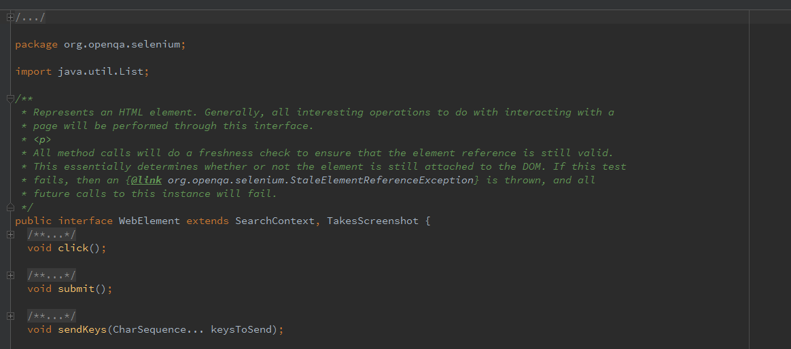

* Ứng dụng *vscraper*
* Selenium

## 1. Ứng dụng *vscraper*

Trong bài học này, các học viên được yêu cầu hoàn thiện phần crawl dữ liệu và ghi ra file theo một trong 2 hướng sau:

* Sử dụng Apache Http Client
* Sử dụng Selenium

### 1.1. Thiết kế generic cho *vscraper*

Một trong các tiêu chí quan trong khi phát triển ứng dụng *vscraper* là mã nguồn cho phần *core* của ứng dụng cần được tách rời khỏi cấu trúc trang cụ thể. Học viên có thể tham khảo thiết kế trong link dưới đây

https://github.com/mto/vscraper

Trong GitHub reporitory trên thì ứng dụng *vscraper* gồm các class chính sau:

* HttpBot/SeleniumBot: Classes đảm nhận việc crawl dữ liệu & ghi ra file
* BotWriter: Class đảm nhận việc đọc & ghi trực tiếp ra file
* Config: Class chứa thông tin về target website

```java
package com.techmaster.vscraper.config;

/**
 * @author <a href="hoang281283@gmail.com">Minh Hoang TO</a>
 * @date: 13/09/2017
 */
public abstract class Config {

    /**
     *
     * @return name of targeted website, such as 'vnexpress.net', 'dantri.com.vn'
     */
    public abstract String getTargetName();

    public abstract String getHomeLink();

    public abstract String getNewsLink();

    public abstract String getVideosLink();

    public abstract String getSportsLink();
}

```

__Bài tập 1:__

*Clone repository **vscraper***

### 1.2. BotWriter

Class *com.techmaster.vscraper.io.BotWriter* đảm nhận việc ghi trực tiếp dữ liệu HTML ra file system

```java
package com.techmaster.vscraper.io;

import java.io.ByteArrayInputStream;
import java.io.File;
import java.io.InputStream;
import java.nio.charset.Charset;
import java.nio.file.Path;

/**
 * @author <a href="hoang281283@gmail.com">Minh Hoang TO</a>
 * @date: 13/09/2017
 */
public class BotWriter {

    private final String rootDir;

    public BotWriter() {
        this(System.getProperty("java.io.tmpdir"));
    }

    public BotWriter(String absPath) {
        rootDir = absPath;
        File f = new File(rootDir);
        if (!f.exists()) {
            f.mkdirs();
        }
    }

    public void mkDirs(String relativePath) {
        File f = new File(rootDir + relativePath);
        if (!f.exists() || !f.isDirectory()) {
            f.mkdirs();
        }
    }

    public void streamToFile(InputStream in, String dstPath) {
        Path path = new File(rootDir + dstPath).toPath();
        //TODO: Use methods in java.nio.file.Files to write to destinatation file in REPLACE_EXISTING mode
    }

    public void stringToFile(String s, String dstPath) {
        streamToFile(new ByteArrayInputStream(s.getBytes(Charset.defaultCharset())), dstPath);
    }
}
```

__Bài tập 2:__

*Hoàn thiện method **streamToFile** trong class BotWriter theo yêu cầu*

__Bài tập 3:__

*Hoàn thiện class com.techmaster.vscraper.io.BotWriterTest theo yêu cầu và chạy test với Maven command*

```shell
mvn clean test -Dtest=BotWriterTest
```

### 1.3. HttpBot

Vai trò của class *com.techmaster.vscraper.HttpBot* bao gồm:

* Sử dụng ApacheHttpClient để lấy content HTML từ 1 trang báo
* Lưu content HTML ra file, thông qua BotWriter

```java
package com.techmaster.vscraper;

import com.techmaster.vscraper.config.Config;
import com.techmaster.vscraper.io.BotWriter;
import org.apache.http.client.HttpClient;
import org.apache.http.impl.client.HttpClientBuilder;

/**
 * @author <a href="hoang281283@gmail.com">Minh Hoang TO</a>
 * @date: 13/09/2017
 */
public class HttpBot {

    private final Config cfg;

    private final BotWriter bw;

    private final HttpClient httpClient;

    public HttpBot(Config cfg, BotWriter bw) {
        this.cfg = cfg;
        this.bw = bw;

        bw.mkDirs("/" + cfg.getTargetName());

        httpClient = HttpClientBuilder.create().build();
    }

    public void fetchHomePage() {
        try {
            String homeLink = cfg.getHomeLink();
            //TODO: Use ApacheHttpClient to fetch and save content as cfg.getTargetName() + /home.html
        } catch (Exception ex) {
            ex.printStackTrace();
        }
    }

    public void fetchNewsPage() {
        //TODO: Fetch content of news page and save it as cfg.getTargetName() + /news.html
    }

    public void fetchVideosPage() {
        //TODO: Fetch content of news page and save it as cfg.getTargetName() + /videos.html
    }

    public void fetchSportsPage() {
        //TODO: Fetch content of news page and save it as cfg.getTargetName() + /sports.html
    }

}
```

__Bài tập 4:__

*Hoàn thiện các phần TODO trong class HttpBot*

__Bài tập 5:__

*Hoàn thiện HttpBotTest và chạy test với Maven command*

```shell
mvn clean test -Dtest=HttpBotTest
```

## 2. Selenium


Automation library:

* Cho phép giả lập *action* của người dùng trên trình duyệt
* Hỗ trợ các trình duyệt phổ biến: *Chrome*, *Firefox*, *Safari*, *Tor Browser*,...

### 2.1. Khai báo Selenium *artifact* trong Maven project

```xml
        <dependency>
            <groupId>org.seleniumhq.selenium</groupId>
            <artifactId>selenium-java</artifactId>
            <version>3.5.3</version>
        </dependency>
```

https://mvnrepository.com/artifact/org.seleniumhq.selenium/selenium-java

### 2.2. WebDriver

WebDriver đóng vai trò của *browser* được sử dụng để truy cập vào website.

Để khởi tạo *instance* của WebDriver có thể dùng một trong các lựa chọn sau

```java
        new ChromeDriver();
        new FirefoxDriver();
        new SafariDriver();
        new PhantomJSDriver();
        
```

### 2.3. WebElement

Class *org.openqa.selenium.WebElement* được sử dụng để mô phỏng DOM element trong cấu trúc HTML của 1 website, với các method chính sau:

* Tìm kiếm, navigate trong cấu trúc DOM của trang
* Giả lập các action của người dùng như: *click, type,...* 
* Bóc tách dữ liệu HTML, lưu screenshot



### 2.4. SeleniumBot

Vai trò của class SeleniumBot:

* Truy cập vào website sử dụng thư viện Selenium
* Lưu dữ liệu HTML, screenshot vào file thông qua BotWriter

```java
package com.techmaster.vscraper;

import com.techmaster.vscraper.config.Config;
import com.techmaster.vscraper.io.BotWriter;
import org.openqa.selenium.WebDriver;
import org.openqa.selenium.WebElement;
import org.openqa.selenium.chrome.ChromeDriver;
import org.openqa.selenium.firefox.FirefoxDriver;

/**
 * @author <a href="hoang281283@gmail.com">Minh Hoang TO</a>
 * @date: 13/09/2017
 */
public class SeleniumBot {

    private final Config cfg;

    private final BotWriter bw;

    private final WebDriver browser;

    public SeleniumBot(Config cfg, BotWriter bw){
        this.cfg = cfg;
        this.bw = bw;

        bw.mkDirs("/" + cfg.getTargetName());

        browser = new ChromeDriver();
    }

    public void fetchHomePage() {
        try {
            browser.get(cfg.getHomeLink());
            String homeSrc = browser.getPageSource();
            //TODO:
            // 1. Save content as cfg.getTargetName() + /home.html
            // 2. Takes screenshot and save it as  cfg.getTargetName() + /home_screnshot.png
        } catch (Exception ex) {
            ex.printStackTrace();
        }
    }

    public void fetchNewsPage() {
        //TODO:
        // 1. Save content as cfg.getTargetName() + /news.html
        // 2. Takes screenshot and save it as  cfg.getTargetName() + /news_screnshot.png
    }

    public void fetchVideosPage() {
        //TODO:
        // 1. Save content as cfg.getTargetName() + /videos.html
        // 2. Takes screenshot and save it as  cfg.getTargetName() + /videos_screnshot.png
    }

    public void fetchSportsPage() {
        //TODO:
        // 1. Save content as cfg.getTargetName() + /sports.html
        // 2. Takes screenshot and save it as  cfg.getTargetName() + /sports_screnshot.png
    }

}
```

__Bài tập 6:__

*Tìm hiểu các method hỗ trợ trong WebDriver & WebElement và hoàn thiện class SeleniumBot*

__Bài tập 7:__

*Hoàn thiện class com.techmaster.vscraper.SeleniumBotTest và chạy test với Maven command*

```shell
mvn clean test -Dtest=SeleniumBotTest
```