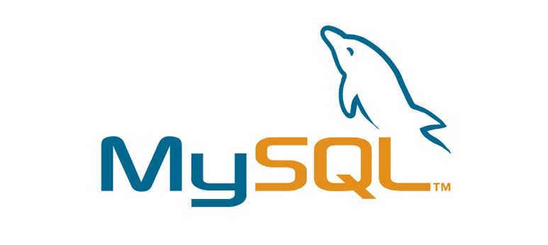
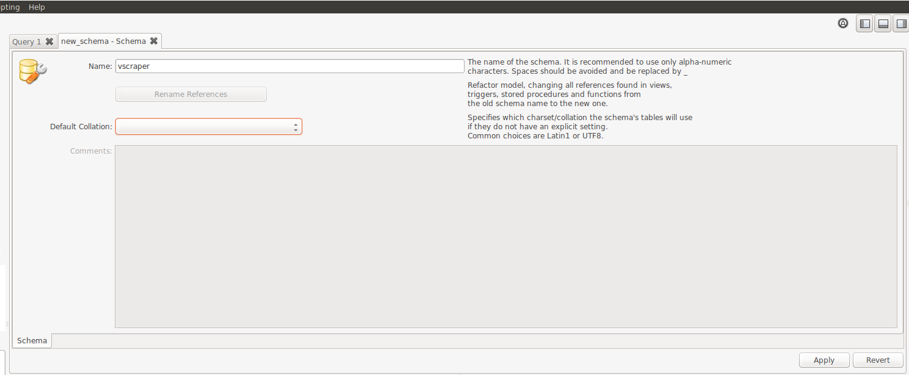
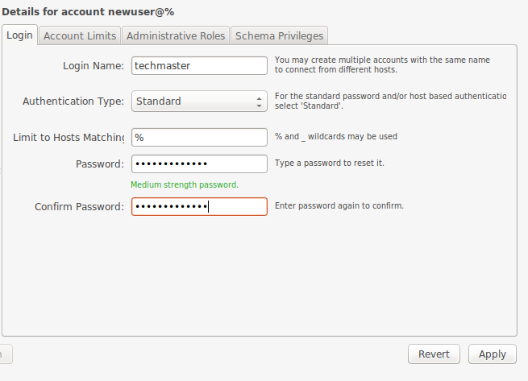
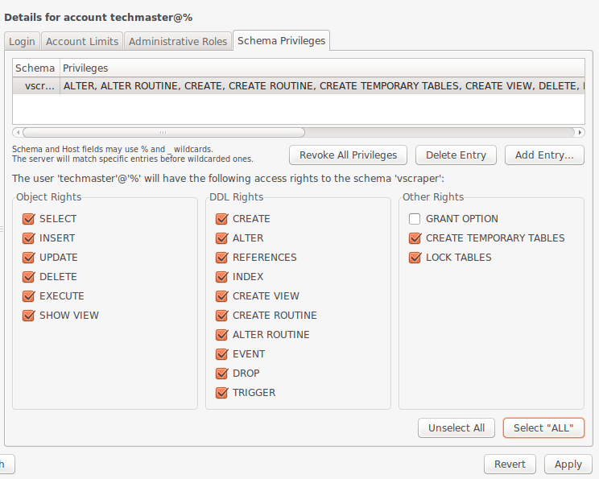
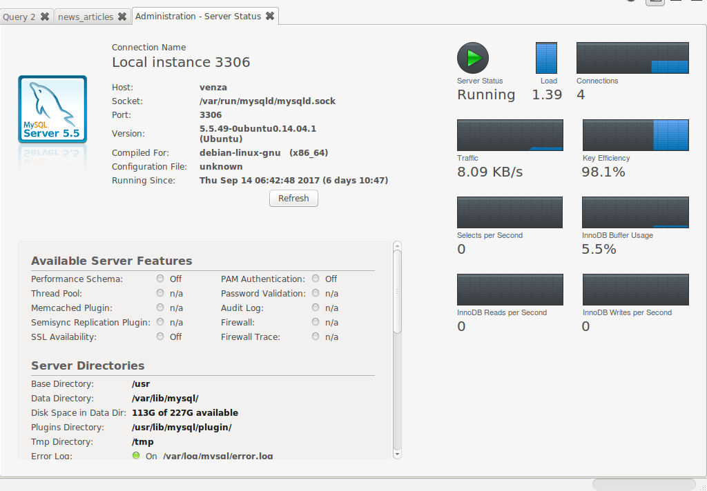

* Cài đặt & sử dụng MySQL
* JDBC - Java Database Connectivity
* Ứng dụng *vscraper*

## 1. Database Management System

Nhu cầu tương tác với data bao gồm:

* Lưu trữ (*store*)
* Truy vấn (*query*)

DBMS: Phần mềm giải pháp hỗ trợ việc *lưu trữ* và *truy vấn* các dữ liệu *có cấu trúc*

Các giải pháp DBMS phổ biến:
<br><br>
<br><br>

|Name|Link|
|---|---|
|MySQL|https://www.mysql.com/|
|MariaDB|https://mariadb.org/|
|PostgresSQL|https://www.postgresql.org/|
|Oracle|https://www.oracle.com/database/index.html|
|MongoDB|https://www.mongodb.com/|
|Neo4J|https://neo4j.com/|

*Trong phạm vi khóa học này, ta sẽ sử dụng MySQL cho các bài toán lưu trữ và truy vấn dữ liệu*

### 1.1. Cài đặt MySQL



https://dev.mysql.com/downloads/mysql/

__Bài tập 1:__

*Cài đặt MySQL phiên bản Community trên máy*

### 1.2. Cài đặt MySQL Workbench

https://dev.mysql.com/downloads/workbench/

MySQL Workbench: Công cụ tương tác với MySQL qua giao diện

__Bài tập 2:__

*Cài đặt MySQL Workbench trên máy và kết nối với MySQL bằng tài khoản **root** thiết lập lúc cài đặt MySQL*

### 1.3. Tạo *account* và *schema*

1.3.1. Tạo schema *vscraper*
<br><br>

<br><br>
* Click *Create a new schema ...* từ menu của MySQL Workbench
* Điền tên schema như hình trên và click *Apply*

1.3.2. Tạo account *techmaster*

* Click *Users and Privileges -> Add Account*
* Chọn username/password lần lượt bằng *techmaster/java-course123*
<br><br>

<br><br>
* Click *Apply*
* Click *Schema Privileges -> Add Entry -> Selected Schema*
* Chọn *vscraper*, click *OK*
* Chọn *Select ALL* như hình dưới đây và click *Apply*
<br><br>


### 1.3. Tạo cấu trúc bảng trong *vscraper*

Execute SQL script sau từ cửa sổ query của MySQL Workbench

```sql
CREATE TABLE `vscraper`.`news_articles` (
  `id` VARCHAR(255) NOT NULL,
  `title` VARCHAR(255) NULL,
  `link` VARCHAR(255) NULL,
  `content` MEDIUMTEXT NULL,
  `origin` VARCHAR(255) NULL,
  `origin_id` VARCHAR(255) NULL,
  `created` TIMESTAMP NULL,
  `updated` TIMESTAMP NULL,
  `deleted` TIMESTAMP NULL,
  PRIMARY KEY (`id`));
```

Sau khi thực thi script trên thành công, ta thu được bảng *news_articles* trong *vscraper*


__Bài tập 3:__

*Tạo các bảng sau đây có cấu trúc tương tự như **news_articles***

* *sport_articles*
* *video_links*

### 1.4. CRUD operations

* Create
* Read
* Update
* Delete

1.4.1. CREATE

Để tạo record trong bảng của MySQL, ta dùng INSERT query

```sql
INSERT INTO TABLE_NAME (column1, column2, column3,...columnN)
VALUES (value1, value2, value3,...valueN);
```

https://www.tutorialspoint.com/sql/sql-insert-query.htm

__Bài tập 4:__
*Thực thi INSERT query dưới đây*

```sql
INSERT INTO vscraper.news_articles (id, title, link, content, origin, origin_id) VALUES ('vnexpress_3643914', 'Hủy diệt Triều Tiên - đe dọa chưa từng có tiền lệ của Trump', 'https://vnexpress.net/tin-tuc/the-gioi/phan-tich/huy-diet-trieu-tien-de-doa-chua-tung-co-tien-le-cua-trump-3643914.html', 'Tổng thống Mỹ Trump ngày 19/9 có tuyên bố gây kinh ngạc khi nói về Triều Tiên trong bài phát biểu đầu tiên của ông tại Đại Hội đồng Liên Hợp Quốc. \"Mỹ có sức mạnh và sự kiên nhẫn lớn lao, nhưng nếu bị buộc phải bảo vệ bản thân hoặc các đồng minh, chúng tôi sẽ không có lựa chọn nào ngoại trừ huỷ diệt hoàn toàn Triều Tiên\", ông nói.\n\nCác tuyên bố của Trump về Triều Tiên trước đó đã rất cứng rắn. Tháng trước, ông đe dọa \"trút lửa và thịnh nộ\" lên Triều Tiên. Tuy nhiên, \"lửa và thịnh nộ\" có thể được hiểu là lời đe dọa loại bỏ chính quyền Kim Jong-un. \"Hủy diệt hoàn toàn Triều Tiên\" dường như là một tín hiệu với người dân Triều Tiên rằng họ cũng có thể bị xóa sổ. Trump dường như đưa ra lời đe dọa chưa từng có tiền lệ về việc xóa sổ toàn bộ quốc gia, có thể bằng vũ khí thông thường hoặc vũ khí hạt nhân, theo Washington Post.\n\nMột điều khác biệt nữa là tuyên bố của Trump được đưa ra trong một bài phát biểu được chuẩn bị kỹ càng, không giống như lời đe dọa \"trút lửa và thịnh nộ\" mà Nhà Trắng từng thừa nhận là lời bình luận bột phát của Tổng thống.\n\nSau bài phát biểu, Nhà Trắng dường như cố gắng làm dịu lời đe dọa của Trump, so sánh nó với điều Tổng thống Obama nói vào năm ngoái. \"Chúng tôi rõ ràng có thể hủy diệt Triều Tiên bằng vũ khí của chúng tôi\", Obama nói.\n\nTuy nhiên, Obama nói thêm rằng: \"Nhưng ngoài những hậu quả nhân đạo của việc đó thì họ còn đang ở ngay bên cạnh đồng minh quan trọng của chúng ta, Hàn Quốc\". Obama khi đó không đưa ra lời đe dọa và chỉ nói đến thực tế. Trump thì dọa rằng Mỹ có thể \"không có lựa chọn\" nào khác ngoài việc làm điều đó.\n\nCác chuyên gia nhận xét Trump có lẽ đang đi theo hướng tỏ ra mình khó đoán và bốc đồng để các nhà lãnh đạo thế giới khác phải lo sợ làm ông tức giận.\n\n\"Dường như ông ấy được cố vấn rằng việc đưa ra những ngôn từ ngày càng gay gắt hơn sẽ hăm dọa được Kim Jong-un nhưng tôi không thấy bất kỳ bằng chứng nào như vậy\", cựu phát ngôn viên Bộ Ngoại giao Mỹ John Kirby nói.\n\nMột quan chức cấp cao của Liên Hợp Quốc cho biết khán phòng đã sửng sốt khi Trump đưa ra tuyên bố. \"Bạn có thể cảm thấy cơn gió lạnh lẽo thổi qua phòng khi ông ấy nói vậy\", quan chức nói.', 'vnexpress', '3643914');

```
<br><br>

Đoạn script trên tạo 1 *record* trong bảng *news_articles*, chứa các thông tin về bài báo:

https://vnexpress.net/tin-tuc/the-gioi/phan-tich/huy-diet-trieu-tien-de-doa-chua-tung-co-tien-le-cua-trump-3643914.html

__Bài tập 4+:__

*Dùng INSERT query để tạo thêm các record trong bảng **news_articles***

1.4.2. READ

Để truy vấn dữ liệu từ bảng trong MySQL, ta dùng SELECT query

```sql
SELECT column1, column2, columnN FROM table_name WHERE [condition]
```

https://www.tutorialspoint.com/sql/sql-select-query.htm

__Bài tập 5:__

*Thực thi query dưới đây lấy link từ các record có nguồn từ **vnexpress***

```sql
 SELECT link FROM news_articles WHERE origin='vnexpress';
```

__Bài tập 5+:__

*Thực thi query lấy link các bài báo có title chứa cụm từ **BOT***

1.4.3.UPDATE

Để cập nhật record trong bảng trong MySQL, ta dùng UPDATE query

```sql
UPDATE table_name SET column1=value1, column2=value2, columnN=valueN WHERE [condition]
```

https://www.tutorialspoint.com/sql/sql-update-query.htm

1.4.4.DELETE

Để xóa record trong bảng trong MySQL, ta dùng UPDATE query

```sql
DELETE FROM table_name WHERE [condition]
```

https://www.tutorialspoint.com/sql/sql-delete-query.htm

## 2. JDBC - Java Database Connectivity


<br><br>
JDBC là API trong Java Core cho phép một chương trình Java thực thi *CRUD operations* trên *Relational* DBMS

* JDBC API không phụ thuộc vào RDBMS cụ thể
* Tương tác với DBMS cụ thể được xử lý thông qua *driver* do *DBMS vendor* cung cấp.

Trong cấu trúc packages của Java Core thì JDBC được tổ chức trong 2 packages sau đây:

* *java.sql*: https://docs.oracle.com/javase/8/docs/api/java/sql/package-summary.html
* *javax.sql*: https://docs.oracle.com/javase/8/docs/api/javax/sql/package-summary.html

### 2.2. JDBC Drivers

JDBC làm việc một cách gián tiếp với DBMS, thông qua các thư viện *driver* được cung cấp bởi nhà cung cấp DBMS

*Danh sách các thư viện JDBC drivers theo RDBMS*

|RDBMS|JDBC connector|
|---|---|
|MySQL|https://mvnrepository.com/artifact/mysql/mysql-connector-java|
|PostgreSQL|https://mvnrepository.com/artifact/org.postgresql/postgresql|
|OracleDB|http://www.oracle.com/technetwork/database/application-development/index-099369.html|

### 2.3. Kết nối Java application với MySQL

Để có thể kết nối Java application với MySQL, ta cần khai báo thư viện *JDBC driver* cho MySQL trong Maven

```xml
<dependency>
    <groupId>mysql</groupId>
    <artifactId>mysql-connector-java</artifactId>
    <version>5.1.44</version>
</dependency>
```

__Bài tập 6:__

*Tạo Maven project **session12** với khai báo dependency như trên và chạy command Maven sau*

```shell
mvn clean install
```

### 2.4. Tạo *connection* với MySQL

JDBC sử dụng class *java.sql.Connection* để mô phỏng connection giữa Java application và DBMS, mọi command tương tác với DBMS đều được gửi qua *connection*
<br><br>

```java
package com.techmaster.javacourse;

import java.sql.Connection;
import java.sql.DriverManager;
import java.sql.SQLException;

/**
 * @author <a href="hoang281283@gmail.com">Minh Hoang TO</a>
 * @date: 20/09/2017
 */
public class JDBCMaster {

    private final String username;

    private final String password;

    private final String schema;

    private final String dbURL;

    public JDBCMaster(){
        this("techmaster", "java-course123", "vscraper");
    }

    public JDBCMaster(String username, String password, String schema){
        this.username = username;
        this.password = password;
        this.schema = schema;

        this.dbURL = "jdbc:mysql://localhost:3306/" + schema;

        initDriver();
    }

    private void initDriver(){
        try {
            Class.forName("com.mysql.jdbc.Driver");
        }catch (Exception ex){
            ex.printStackTrace();
        }
    }

    public Connection getConnection() throws SQLException {
        return DriverManager.getConnection(dbURL, username, password);
    }

    public static void main(String[] args) throws Exception {
        JDBCMaster jdbcm = new JDBCMaster();

        System.out.println(jdbcm.getConnection());
    }
}
```

__Bài tập 7:__

*Tạo class JDBCMaster như trên, sau đó debug với break-point ở dòng System.out.println, kiểm tra các connection trong mục Server Status trên MySQL Workbench*

<br><br>


### 2.5. CRUD operations

Các CRUD operations thông qua JDBC được thực thi bằng cách gửi các câu lệnh SQL tới DBMS thông qua *connection*

JDBC sử dụng *statement* để mô phỏng các query SQL được gửi tới DBMS. Đoạn mã dưới đây minh họa việc tạo *statement* từ *connection*

```java
    Connection con = jdbcm.getConnection();
    PreparedStatement ps = con.prepareStatement("SELECT link FROM news_articles WHERE origin='vnexpress';");
```

Để thực thi CRUD operations ta sử dụng một trong các method sau trên object java.sql.PreparedStatement

* execute()
* executeQuery()
* executeUpdate()

__Bài tập 8:__

*Thực thi các query SQL đã làm ở phần 1 trên JDBCMaster*

## 3. Ứng dụng *vscraper*

Các học viên được yêu cầu tích hợp MySQL vào ứng dụng *vscraper*. Các dữ liệu bóc tách từ HTML có thể được lưu trữ và truy vấn thông qua MySQL

__Bài tập 9:__

*Dùng Jsoup tách dữ liệu từ các file .html và lưu vào các bảng trong schema **vscraper***