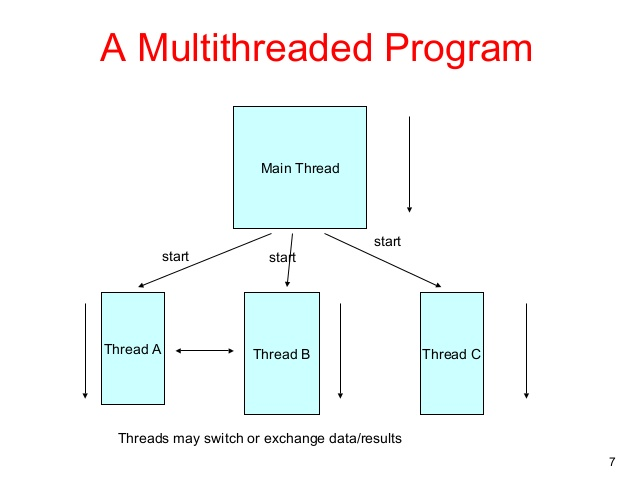
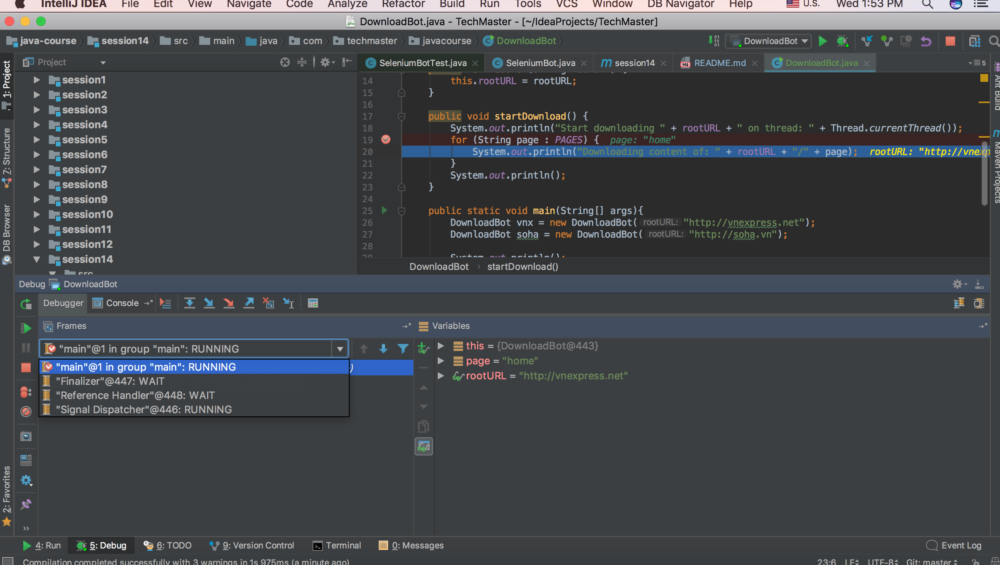
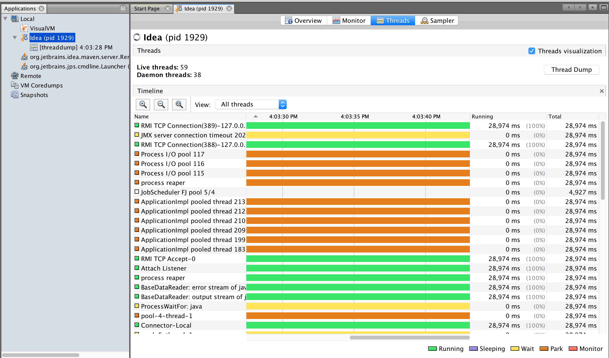

* Giới thiệu về *Multithreading* trong Java




### 1.1. Download đồng thời nhiều website

Trong mục này, các học viên được yêu cầu sử dụng class *DownloadBot* được cung cấp để giả lập việc:

* Tải lần lượt các pages từ 2 website
* Tải đồng thời các pages từ 2 website

```java
package com.techmaster.javacourse;

/**
 * @author <a href="hoang281283@gmail.com">Minh Hoang TO</a>
 * @date: 9/27/17
 */
public class DownloadBot {

    private final static String[] PAGES = new String[]{"home", "news", "videos", "health", "blog"};

    private String rootURL;

    public DownloadBot(String rootURL) {
        this.rootURL = rootURL;
    }

    public void startDownload() {
        System.out.println("Start downloading " + rootURL + " on thread: " + Thread.currentThread());
        for (String page : PAGES) {
            System.out.println("Downloading content of: " + rootURL + "/" + page);
        }
        System.out.println();
    }
}

```


__Bài tập 1:__

*Tạo hàm main trong class DownloadBot như dưới đây và nhận xét về thứ tự các message in ra màn hình*

```java
public static void main(String[] args){
    DownloadBot vnx = new DownloadBot("http://vnexpress.net");
    DownloadBot soha = new DownloadBot("http://soha.vn");

    System.out.println();

    vnx.startDownload();
    soha.startDownload();
}
```

__Bài tập 2:__

*Cập nhật hàm main như dưới đây và làm lại yêu cầu của bài tập 1*

```java
public static void main(String[] args){
    final DownloadBot vnx = new DownloadBot("http://vnexpress.net");
    final DownloadBot soha = new DownloadBot("http://soha.vn");

    System.out.println();

    Thread vnxThread = new Thread(){
        @Override
        public void run() {
            vnx.startDownload();
        }
    };
    vnxThread.setName("VNX-Thread");

    Thread sohaThread = new Thread(){
        @Override
        public void run() {
            soha.startDownload();
        }
    };
    sohaThread.setName("SOHA-Thread");

    vnxThread.start();
    sohaThread.start();

    //vnx.startDownload();
    //soha.startDownload();
}
```


### 1.2. Khởi tạo *thread* trong Java

Các class chính liên quan đến việc khởi tạo *thread* trong Java

* java.lang.Thread: Class mô phỏng *thread*
* java.lang.Runnable: Class wrap *tác vụ* được thực thi trong *thread*


```java
Thread t = new Thread(){

  public void run(){
     //DO SOMETHING
  }
};


Runnable r = new Runnable(){
  public void run(){
    //DO SOMETHING
  }
};

Thread t = new Thread(r);
```

__Bài tập 3:__

*Sửa hàm main trong BotDownload theo hướng sử dụng Runnable để tạo các thread download các website*

**Chú ý:**

*Runnable chỉ đóng vai trò là wrapper cho tác vụ được thực thi trong *thread* và không liên quan đến việc tạo *thread* ở mức Operating System*

```java
Runnable r = new Runnable(){
  //DO SOMETHING
};

r.run(); //Execute DO SOMETHING on current thread


new Thread(r).start(); //Execute DO SOMETHING on new thread
```

### 1.3. Contextual *thread*



Một đoạn code bất kỳ khi được thực thi sẽ được thực thi trên 1 *thread* nào đó, ta gọi thread này là *contextual thread*. Có thể xem thông tin về *contextual thread* thông qua:

* Method Thread.currentThread()

```java
Thread.currentThread();
```

* Giao diện của debugger

__Bài tập 4:__

*Debug DownloadBot và kiểm tra thông tin về contextual thread trong giao diện của debugger*

### 1.4. *java.util.concurrent.ExecutorService*

https://docs.oracle.com/javase/8/docs/api/index.html?java/util/concurrent/package-summary.html

Java cung cấp một số utility class cho phép thực thi các tác vụ trên một  một nhóm cố định các thread được khởi tạo sẵn.

* java.util.concurrent.ExecutorService
* java.util.concurrent.Executors


```java
        ExecutorService workers = Executors.newFixedThreadPool(5);
        workers.submit(new Runnable() {
            public void run() {
                //TODO: Do something
            }
        });

```

__Bài tập 5:__

*Thay đổi hàm main trong DownloadBot theo hướng sử dụng ExecutorService*

### 1.5. java.util.concurrent.CountDownLatch

CountDownLatch hỗ trợ nhu cầu suspend việc thực thi các tác vụ trên thread cho đến khi điều kiện nào đó được thoả mãn

```java
final CountDownLatch latch = new CountDownLatch(1);

Thread t1 = new Thread(){

 public void run(){
    try{
      latch.await();
      //Do main job
    }catch(InterruptedException ex){

    }
 }
};

t1.start();

Thread t2 = new Thread(){

 public void run(){
    try{
      latch.await();
      //Do main job
    }catch(InterruptedException ex){

    }
 }
};

t2.start();

latch.countDown();
```

__Bài tập 6:__

*Thêm CountDownLatch đảm bảo việc download soha.vn chỉ được thực thi sau khi download xong trang 'home' của vnexpress*

### 1.6. *daemon* thread

JVM lifecycle:

*JVM sẽ dừng khi mọi non-daemon thread kết thúc*

Một số background *thread* được thiết kế là *daemon* (thông qua Thread.setDaemon()) với mục đích các thread này sẽ tự động dừng (do JVM dừng)

__Bài tập 7:__

*Tạo daemon thread với vòng lặp vô hạn và chạy hàm start() của thread từ hàm main() của DownloadBot*

### 1.7. Công cụ JVisualVM


<br><br>
Công cụ JVisualVM cung cấp *insight view* (bao gồm thread view) cho ứng dụng Java

```shell
jvisualvm
```

