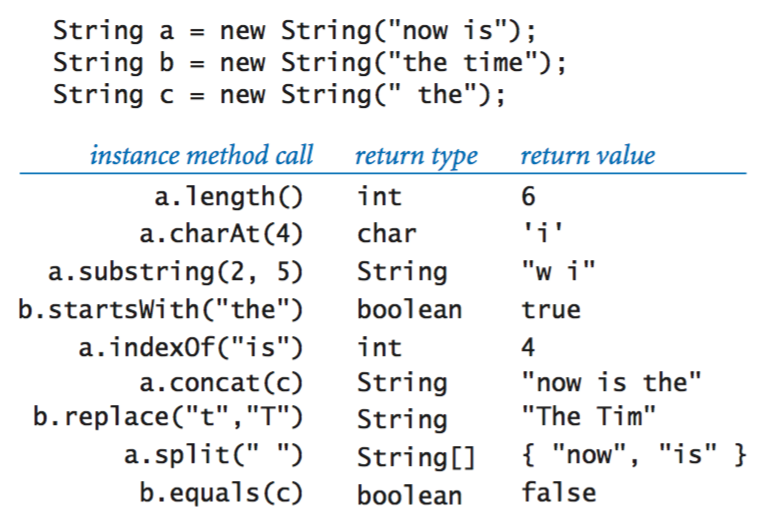
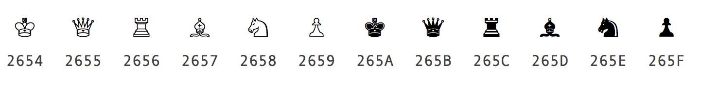
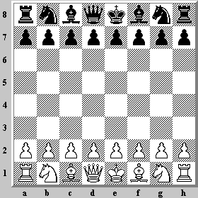
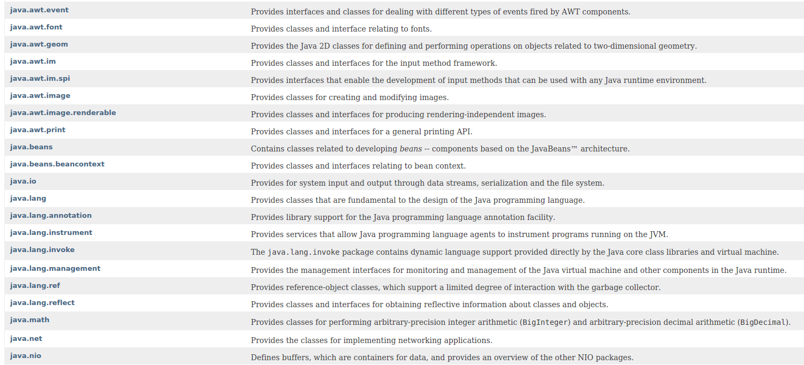
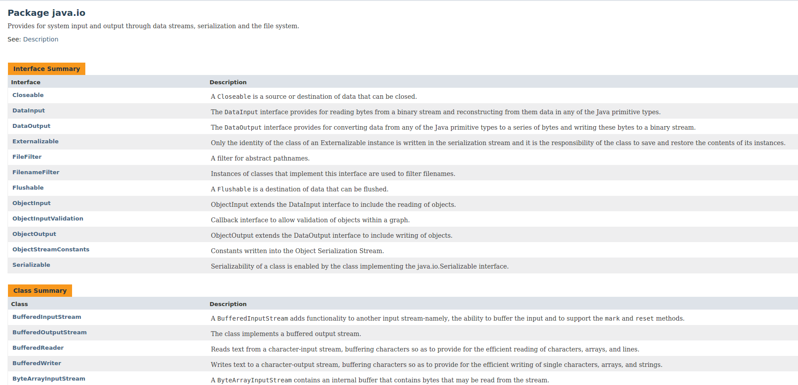

* Làm việc với *String*
* *Class* & *method*
* *package* trong Java
* Đọc & ghi file

## 1. Làm việc với String

https://docs.oracle.com/javase/8/docs/api/java/lang/String.html

*String* trong Java (và trong hầu hết các ngôn ngữ lập trình khác) được dùng để biểu diễn một chuỗi các *ký tự*

### 1.1 Khai báo biến thuộc kiểu *String*

 ```java
 String s1 = "TechMaster Java Course";

 String s2;
 s2 = "Khóa học lập trình Java";

 System.out.println(s1);
 System.out.println(s2);
 System.out.println(s1 + " - " + s2);
 ```

__Bài tập 1:__

*Tạo file StringMaster.java với hàm *main* có nội dung trên và chạy trên dòng lệnh*

### 1.2 Tương tác với biến thuộc kiểu *String*



__Bài tập 2:__

*In ra màn hình chiều dài và các ký tự nằm trong các chuỗi s1, s2 trong StringMaster.java*

__Bài tập 3:__

*Thêm khai báo biến s3 như dưới đây trong StringMaster.java và in ra màn hình các từ tiếng Anh trong chuỗi s3*

```java
String s3= "Woman without her man is nothing";
```

__Chú ý:__

Để làm bài tập 3 ta cần dùng method *split* strong String. Method này trả về giá trị thuộc kiểu *String[]* (kiểu *array* sẽ được học trong bài học sau). Ta có thể dùng vòng lặp trên giá trị trả về của hàm *split* như sau:

 ```java
 String[] words = ...;

 for(int i=0;i< words.length;i++){
   System.out.println(words[i]);
 }
 ```

### 1.3 Ký tự **Unicode** trong *String*

Ngoài các ký tự *alphabet* và chữ số thì *String* trong Java còn hỗ trợ các ký tự đặc biệt có cấu trúc

```java
'\uXXXX'
```

* Bắt đầu bằng '\u'
* Gồm 4 ký tự nằm sau '\u', mỗi ký tự này nhận một trong các giá trị

```shell
0, 1, 2, 3, 4, 5, 6, 7, 8, 9, A, B, C, D, E, F
```

Chạy đoạn code sau đây trên dòng lệnh

```java
public class ChessBoard{
   public static void main(String[] args){
    System.out.println('\u2655');
    }
}
```



__Bài tập 4:__

*Tạo file ChessBoard.java với hàm *main* in ra màn hình bàn cờ vua (bỏ qua yêu cầu vẽ các ô đen, trắng) như trong hình dưới đây*




## 2. Class & Method

* *java.lang.String* là class trong Java Core
* *length(), substring(), charAt(),...* là các *method* được định nghĩa trong class *java.lang.String*

### 2.1 Mục đích của *method*

```java
public static void main(String[] args){
    System.out.println("An");
    System.out.println("Engineer");
    System.out.println(30);

    System.out.println("Binh");
    System.out.println("Engineer");
    System.out.println(25);

    System.out.println("Cuong");
    System.out.println("Security");
    System.out.println(47);

    System.out.println("Nam");
    System.out.println("Driver");
    System.out.println(30);
}
```

vs

```java
public static void printPersonInfo(String name, String job, int age){
    System.out.println(name);
    System.out.println(job);
    System.out.println(age);
}

public static void main(String[] args){
    printPersonInfo("An", "Engineer", 30);
    printPersonInfo("Binh", "Engineer", 25);
    ...
}
```

## 3. *package* trong Java



## 4. Đọc & ghi file trong Java

