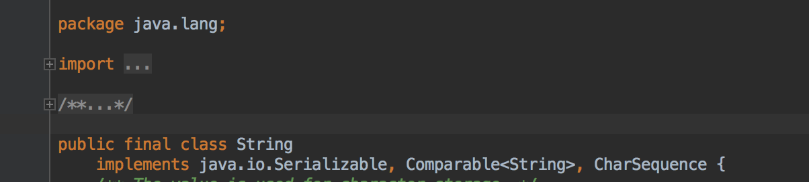

* Làm việc với *String*
* *Class* & *method*
* *package* trong Java

## 1. Làm việc với String

https://docs.oracle.com/javase/8/docs/api/java/lang/String.html

*String* trong Java (và trong hầu hết các ngôn ngữ lập trình khác) được dùng để biểu diễn một chuỗi các *ký tự*

### 1.1 Khai báo biến thuộc kiểu *String*

 ```java
 String s1 = "TechMaster Java Course";

 String s2;
 s2 = "Khóa học lập trình Java";

 System.out.println(s1);
 System.out.println(s2);
 System.out.println(s1 + " - " + s2);
 ```

__Bài tập 1:__

*Tạo file StringMaster.java với hàm *main* có nội dung trên và chạy trên dòng lệnh*

### 1.2 Tương tác với biến thuộc kiểu *String*


__Bài tập 2:__

*In ra màn hình chiều dài và các ký tự nằm trong các chuỗi s1, s2 trong StringMaster.java*

__Bài tập 3:__

*Thêm khai báo biến s3 như dưới đây trong StringMaster.java và in ra màn hình các từ tiếng Anh trong chuỗi s3*

```java
String s3= "Woman without her man is nothing";
```

__Chú ý:__

Để làm bài tập 3 ta cần dùng method *split* strong String. Method này trả về giá trị thuộc kiểu *String[]* (kiểu *array* sẽ được học trong bài học sau). Ta có thể dùng vòng lặp trên giá trị trả về của hàm *split* như sau:

 ```java
 String[] words = ...;

 for(int i=0;i< words.length;i++){
   System.out.println(words[i]);
 }
 ```

### 1.3 Ký tự **Unicode** trong *String*

Ngoài các ký tự *alphabet* và chữ số thì *String* trong Java còn hỗ trợ các ký tự đặc biệt có cấu trúc

```java
'\uXXXX'
```

* Bắt đầu bằng '\u'
* Gồm 4 ký tự nằm sau '\u', mỗi ký tự này nhận một trong các giá trị

```shell
0, 1, 2, 3, 4, 5, 6, 7, 8, 9, A, B, C, D, E, F
```

Cấu trúc này cho phép biểu diễn các ký tự đặc biệt (Ví dụ: chữ tượng hình, symbol,...) thông qua các ký tự *alphabet*. Chuỗi 4 ký tự *XXXX* được gọi là mã **Unicode**


```java
public class ChessBoard{
   public static void main(String[] args){
    System.out.println('\u2655');
    }
}
```

### 1.4 Mã **Unicode** cho quân cờ vua


Hình trên cho ta danh sách mã **Unicode** của các quân cờ trên bàn cờ vua

|Piece|Color|Code|
|:-----:|:----:|:-----:|
|King|white|2654|
|Queen|white|2655|
|Rook|white|2656|
|Bishop|white|2657|
|Knight|white|2658|
|Pawn|white|2659|
|King|black|265A|
|Queen|black|265B|
|Rook|black|265C|
|Bishop|black|265D|
|Knight|black|265E|
|Pawn|black|265F|

__Bài tập 4:__

*Tạo file ChessBoard.java với hàm *main* in ra màn hình bàn cờ vua (bỏ qua yêu cầu vẽ các ô đen, trắng) như trong hình dưới đây*


## 2. Method & Class

* *java.lang.String* là class trong Java Core
* *length(), substring(), charAt(),...* là các *method* được định nghĩa trong class *java.lang.String*

### 2.1 Mục đích của *method*

```java
public static void main(String[] args){
    System.out.println("An");
    System.out.println("Engineer");
    System.out.println(30);

    System.out.println("Binh");
    System.out.println("Engineer");
    System.out.println(25);

    System.out.println("Cuong");
    System.out.println("Security");
    System.out.println(47);

    System.out.println("Nam");
    System.out.println("Driver");
    System.out.println(30);
}
```

vs

```java
public static void printPersonInfo(String name, String job, int age){
    System.out.println(name);
    System.out.println(job);
    System.out.println(age);
}

public static void main(String[] args){
    printPersonInfo("An", "Engineer", 30);
    printPersonInfo("Binh", "Engineer", 25);
    ...
}
```

Việc tạo ra các *method* khi lập trình với bất kỳ ngôn ngữ lập trình nào xuất phát từ các nhu cầu tự nhiên:

* Phân chia code source thành các nhóm dễ kiểm soát
* Tối ưu hoá việc sử dụng lại mã nguồn

## 2.2 *Method* trong Java

*method* trong Java **phải được định nghĩa trong một cấu trúc *class*** nào đó có dạng

```java
public class CLASS_NAME{

}
```

__Chú ý:__

*Học viên xem lại mối liên hệ được đề cập trong bài học trước giữa CLASS_NAME và file mã nguồn .java tương ứng*

Cấu trúc khai báo của *method* trong Java

```java
public class CLASS_CONTAINING_METHOD{

MODIFIER static RETURN_TYPE METHOD_NAME( ARGUMENTS){

}

MODIFIER RETURN_TYPE METHOD_NAME( ARGUMENTS){

}
}
```

* MODIFIER: Nhận các giá trị *public, protected,  ,private*
* RETURN_TYPE: Nhận các giá trị *void, int, boolean, double, char, float, CLASS_NAME*
* METHOD_NAME: Tên method bắt đầu bằng ký tự thường theo quy ước trong Java
* ARGUMENTS: Danh sách các tham số đầu vào

__Ví dụ:__

```java
public int firstMethod(int number, int factor, String s){...}

private String secondMethod(String sms, int index){}

public void printOut(String s, int n){...}

void anotherPrintOut(String s, int n){...}
```

__Bài tập 5:__

*Biên dịch và chạy trên dòng lệnh class MathTable.java có nội dung như sau*

```java
public class MathTable {

    private void printProduct(int i, int j) {
        System.out.println(i + " x " + j + " = " + i * j);
    }

    private void printSum(int i, int j) {
        /**
         * Print out i + j =
         *
         * Ex: 1 + 1 = 2; 2+ 3= 4;...
         */
    }

    private void printFactorial(int i) {
        /**
         * Print out i!=...
         *
         * Ex: 1!=1, 2!= 2, 3!= 6, 5!=120
         */
    }

    public void multiplicationTable() {
        for (int i = 1; i < 11; i++) {
            for (int j = i; j < 11; j++) {
                printProduct(i, j);
            }
            System.out.println();
        }
    }

    public void sumTable() {
        for (int i = 1; i < 11; i++) {
            for (int j = i; j < 11; j++) {
                printSum(i, j);
            }
            System.out.println();
        }
    }

    public void factorialTable() {
        for (int i = 1; i < 11; i++) {
            printFactorial(i);
        }
    }

    public static void main(String[] args) {
        MathTable mt = new MathTable();

        mt.multiplicationTable();
        System.out.println();
        mt.sumTable();
        System.out.println();
        mt.factorialTable();
        System.out.println();
    }

}
```

__Bài tập 6:__

*Hoàn thiện các method trong MathTable.java theo comment mô tả yêu cầu đầu ra*

## 3. *package* trong Java

*package* là khái niệm được đưa ra trong Java nhằm giải quyết vấn đề trùng tên khi khai báo class. Mọi class trong Java sẽ thuộc về một *package* nào đó

Cấu trúc đầy đủ của FILE_NAME.java sẽ có dạng

```java
package PACKAGE_NAME;

public class FILE_NAME{


}
```

PACKAGE_NAME: Tên package bao gồm các ký tự theo quy ước được viết thường và có thể cách nhau bởi dấu '.'

__Ví dụ:__

```
package vn.techmaster;

public class Bot{

public void sayHello(){
    System.out.println("Hello");
}

}
```

Hình dưới đây cho thấy class *java.lang.String* trong Java Core được định nghĩa với package name là *java.lang*



### 3.1 *import* statement

Để dùng class A trong class B thì ta cần dùng lệnh *import* để khai báo tên đầy đủ của A trong B.java

https://docs.oracle.com/javase/tutorial/java/package/usepkgs.html


```java
import vn.techmaster.Bot;

public class TestBot{

    public static void main(String[] args){
       Bot b = new Bot();
       b.sayHello();
    }
}

```

__Bài tập 7:__

*Tạo các file Bot.java và TestBot.java trong cùng thư mục **session2** và biên dịch TestBot.java từ dòng lệnh*

```shell
javac TestBot.java
```

__Bài tập 8:__

*Sửa lỗi biên dịch ở Bài tập 7*

### 3.2 Các *package* trong Java Core (Java SE)


```shell
JAVA_CORE_LIBRARY := JavaSE packages
JavaSE package := JavaSE classes
```

### 3.3. Package *java.io*


__Bài tập 9:__

*Xem JavaDoc và thảo luận về package **java.io***

https://docs.oracle.com/javase/8/docs/api/java/io/package-summary.html