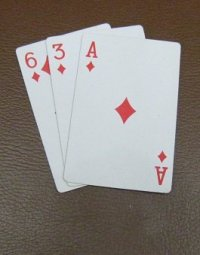

* *Class* & *object* & *method*
* Cấu trúc *array*
* Lập trình game *3 cây*

## 1. *Class* & *object* & *method*

__Bài tập 1:__

*Tạo file **Doctor.java** với nội dung như dưới đây, sau đó biên dịch và chạy trên dòng lệnh và thảo luận về cấu trúc của **Doctor.java** với các kiến thức đã*

```java
public class Doctor{

    public String name;

    public int age;

    public String hospital;

    public String clinic;

    public Doctor(String _name, int _age, String _hospital, String _clinic){
       this.name = _name;
       this.age = _age;
       this.hospital = _hospital;
       this.clinic = _clinic;
    }

    public String basicInfo(){
       return "Name: " + name + ", age: " + age;
    }

    public String getHospital(){
       return hospital;
    }

    public String getClinic(){
       return clinic;
    }

    public static void main(String[] args){
       Doctor d = new Doctor("Mai Trong Hung", 40, "BVPS Hanoi", "PKDK Van Bao");

       System.out.println(d.basicInfo());
       System.out.println(d.getHospital());
       System.out.println(d.getClinic());
    }
}
```

### 1.1 Cấu trúc *đầy đủ* của *class*

```java
public class CLASS_NAME{

/* Block khai báo fields của class */
FIELD_DECLARATIONS

/* Block khai báo constructors của class */
CONSTRUCTOR_DECLARATIONS

/* Block khai báo methods trong class */
METHOD_DECLARATIONS

}
```

* FIELD_DECLARATIONS:

Ví dụ:

```java
public String firstName;

public String lastName;

private int age;

private String email;
```

__Chú ý:__

*Để đơn giản thì trong các buổi học đầu ta coi như chỉ sử dụng **public** trong khai báo field của *class**

* CONSTRUCTOR_DECLARATIONS


```java
public class CLASS_NAME{

//First constructor with no arguments
public CLASS_NAME()

}

//Second constructor with two arguments
public CLASS_NAME(String name, int age){

}
```

Về bản chất thì constructor là các method đặc biệt có tên **trùng với tên** của *class*. Method đặc biệt này sẽ được thực thi khi ta thực thi câu lệnh

```java
CLASS_NAME obj = new CLASS_NAME(...);
```

Ví dụ:

```java
Doctor d = new Doctor(...)
```

* METHOD_DECLARATIONS

*Học viên xem lại cấu trúc khai báo *method* trong bài học 2*

### 1.3 Khái niệm *object*


__Bài tập 2:__

*Thêm khai báo field **phoneNumber** vào trong class **Doctor**, cập nhật constructor của class, khai báo thêm method trả về số phone của doctor và cập nhật hàm **main** để in ra màn hình số phone*

## 2. Cấu trúc *array*

__Bài tập 3:__

*Tạo file **ArrayMaster.java** với nội dung như dưới đây rồi biên dịch và chạy từ dòng lệnh*

```java
public class ArrayMaster{

public static void main(String[] args){

 int[] nbs = new int[5];

 for(int i=0;i< nbs.length;i++){
    nbs = i*i;
 }

 for(int i=0;i< nbs.length;i++){
    System.out.print(nbs[i] + " ");
 }

}
```

### 2.1 Cấu trúc *array*

Cấu trúc *array* cho phép lưu trữ một **số lượng cố định** các giá trị **thuộc cùng một kiểu**

```java
TYPE[] VARIABLE_NAME = new TYPE[50];
```

TYPE: Nhận các giá trị *int, double, float, char, long* hoặc bất kỳ *class* nào

### 2.2 Tương tác với cấu trúc *array*

Đọc & ghi theo index

```java
String[] names = new String[]{"Tí", "Sửu", "Dần", "Mão"};

System.out.println(names[2]);

names[2] = "Nguyễn Văn " + names[2];
System.out.println(names[2]);
```

__Bài tập 4:__

*Khai báo mảng gồm 10 số nguyên và điền vào mảng 10 số nguyên ngẫu nhiên nhỏ hơn 100, in ra màn hình*


## 3. Game *3 cây*



Trong phần này, học viên được yêu cầu hoàn thiện game *3 cây* **dựa trên một phần mã nguồn được cung cấp**. Game dựa trên luật chơi *3 cây* thông thường với sửa đổi duy nhất:

* Toàn bộ 52 quân bài được dùng trong trò chơi

Mục đích chính của bài tập game *3 cây*:

1. Làm việc với cấu trúc *array*
2. Làm việc với *class* & *method*
3. Rèn tư duy *bóc tách* ứng dụng

### 3.1. *Bóc tách* chương trình

Trò chơi *3 cây* trong thực tế bao gồm các thành phần sau

* Quân bài
* Người chơi
* Người chia

Do vậy, một cách tự nhiên thì chương trình game ta cần viết có thể được tổ chức gồm các *object* của các *class* sau đây:

* *Card.java* : Mô phỏng quân bài trong bộ bài
* *CardHand.java* : Mô phỏng người chơi với 3 quân bài được chia
* *Dealer.java* : Mô phỏng người chia bài
* *TCGame.java* : Class chứa hàm *main* của chương trình

```java
    public static void main(String[] args) {
        TCGame g = new TCGame();
        for (int i = 0; i < 25; i++) {
            g.newRound();
        }
    }
```

### 3.2. Hoàn thiện code được cung cấp

3.2.1 **Card.java**

**Card.java** mô phỏng quân bài và bao gồm 2 thuộc tính (fields) là *rank* (tương ứng với giá trị của quân bài) và *suit* (tương ứng với chất của quân bài)

```java
public class Card {

    public final static char SPADE = '\u2660';

    public final static char CLUB = '\u2663';

    public final static char DIAMOND = '\u2666';

    public final static char HEART = '\u2665';

    public int rank;

    public int suit;

    public Card(int rank, int suit) {
        this.rank = rank;
        this.suit = suit;
    }

    @Override
    public String toString() {
        if (rank > 0 && rank < 14 && suit >= 0 && suit < 4) {
            //TODO: Trả về chuỗi bao gồm giá trị quân bài + ký tự Unicode cho chất của quân bài
            //theo quy tắc:
            // rank: 1 -> A, 2 -> 2,..., 10 -> 10, 11 -> J, 12-> Q, 13 -> K
            // suit: 0 -> SPADE, 1 -> CLUB, 2 -> DIAMOND, 3 -> HEART
            // Ví dụ:
            // rank = 11, suit = 1  -> trả về chuỗi "J\u2663"
        } else {
            return "INVALID_CARD";
        }
    }

    public static void main(String[] args) {
        System.out.println(new Card(8, 2));
    }
}
```

__Bài tập 5:__

*Hoàn thiện method **toString** trong **Card.java** theo yêu cầu và biên dịch, chạy Card.java trên dòng lệnh*

__Yêu cầu:__

Kết quả in ra màn hình của bài tập 5 phải giống như hình dưới đây


3.2.2 **CardHand.java**

```java
public class CardHand {

    public Card[] cards;

    public String name;

    private int count;

    public CardHand(String name) {
        this.name = name;
        this.cards = new Card[3];
    }

    public void addCard(Card c) {
        if (count >= 3) {
            System.out.println("Cannot add more card");
        } else {
            cards[count] = c;
            count++;
        }
    }

    public void reset() {
        for (int i = 0; i < count; i++) {
            cards[i] = null;
        }
        count = 0;
    }

    public int getScore() {
        if (count != 3) {
            throw new IllegalArgumentException("Need to deal 3 cards");
        } else {
          //TODO: Trả về giá trị điểm tính theo trò 3 cây trong thực tế
        }
    }

    @Override
    public String toString() {
        return name + ": " + getScore() + " | " + cards[0] + " " + cards[1] + " " + cards[2];
    }

    public static void main(String[] args){
        CardHand h = new CardHand("Tí");
        h.addCard(new Card(1, 2));
        h.addCard(new Card(6, 3));
        h.addCard(new Card(11, 0));

        System.out.println(h);
    }

}

```

__Bài tập 6:__

*Hoàn thiện method **getScore** theo yêu cầu trong **CardHand.java**, biên dịch và chạy trên dòng lệnh*

__Yêu cầu:__

Kết quả in ra màn hình phải giống hình dưới đây


3.2.3 **Dealer.java**

```java
public class Dealer {

    public final Card[] cards = new Card[52];

    private int dealtIndex = 51;

    public Dealer() {
        int[] idxs = MathUtil.randomPermutation(52);

        for (int i = 0; i < 52; i++) {
            int idx = idxs[i];

            cards[i] = new Card((idx / 4) + 1, idx % 4);
        }
    }

    public void shuffle() {
        int k = new Random().nextInt(52);
        basicShuffle(k);
    }

    private void basicShuffle(int k) {
        Card[] tmp = new Card[cards.length];

        for (int i = 0; i < 52; i++) {
            tmp[i] = cards[i];

            if (i < (52 - k)) {
                cards[i] = cards[i + k];
            } else {
                cards[i] = tmp[i - (52 - k)];
            }
        }
    }

    public void showCards() {
        for (Card c : cards) {
            System.out.print(c + " ");
        }
    }

    public Card dealCard() {
        Card c = cards[dealtIndex];
        dealtIndex--;

        return c;
    }

    public void reset() {
        dealtIndex = 51;
    }

    public static void main(String[] args) {
        Dealer d = new Dealer();
        d.showCards();

        for (int i = 0; i < 10; i++) {
            d.shuffle();
        }

        d.showCards();
    }
}
```

3.2.4 **TCGame.java**

```java
public class TCGame {

    public final CardHand[] hands = new CardHand[4];

    public final Dealer dealer;

    public int round = 1;

    public TCGame() {
        hands[0] = new CardHand("Tí ");
        hands[1] = new CardHand("Sửu");
        hands[2] = new CardHand("Dần");
        hands[3] = new CardHand("Mão");

        dealer = new Dealer();
    }

    public void newRound() {
        reset();
        shuffleTenTimes();

        for (int i = 0; i < 3; i++) {
            for (int j = 0; j < hands.length; j++) {
                Card c = dealer.dealCard();
                hands[j].addCard(c);
            }
        }

        System.out.println("ROUND " + round + "\n");
        for (int i = 0; i < hands.length; i++) {
            System.out.println(hands[i]);
        }
        System.out.println();

        round++;
    }

    public void shuffleTenTimes() {
        for (int i = 0; i < 10; i++) {
            dealer.shuffle();
        }
    }

    public void reset() {
        for (CardHand h : hands) {
            h.reset();
        }

        dealer.reset();
    }

    public static void main(String[] args) {
        TCGame g = new TCGame();
        for (int i = 0; i < 25; i++) {
            g.newRound();
        }
    }
}
```