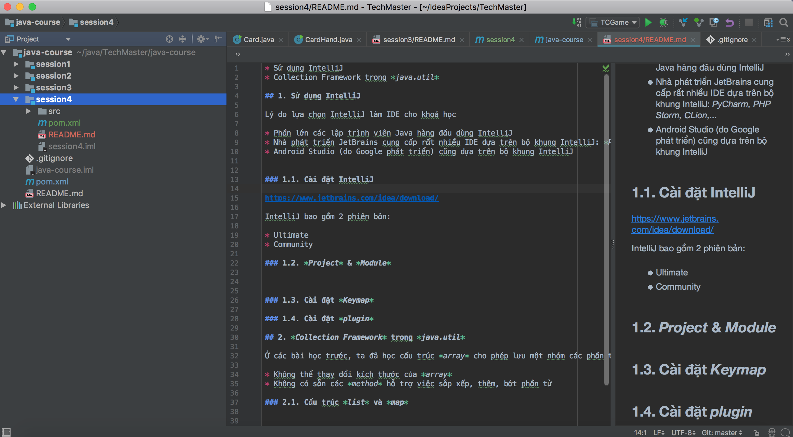
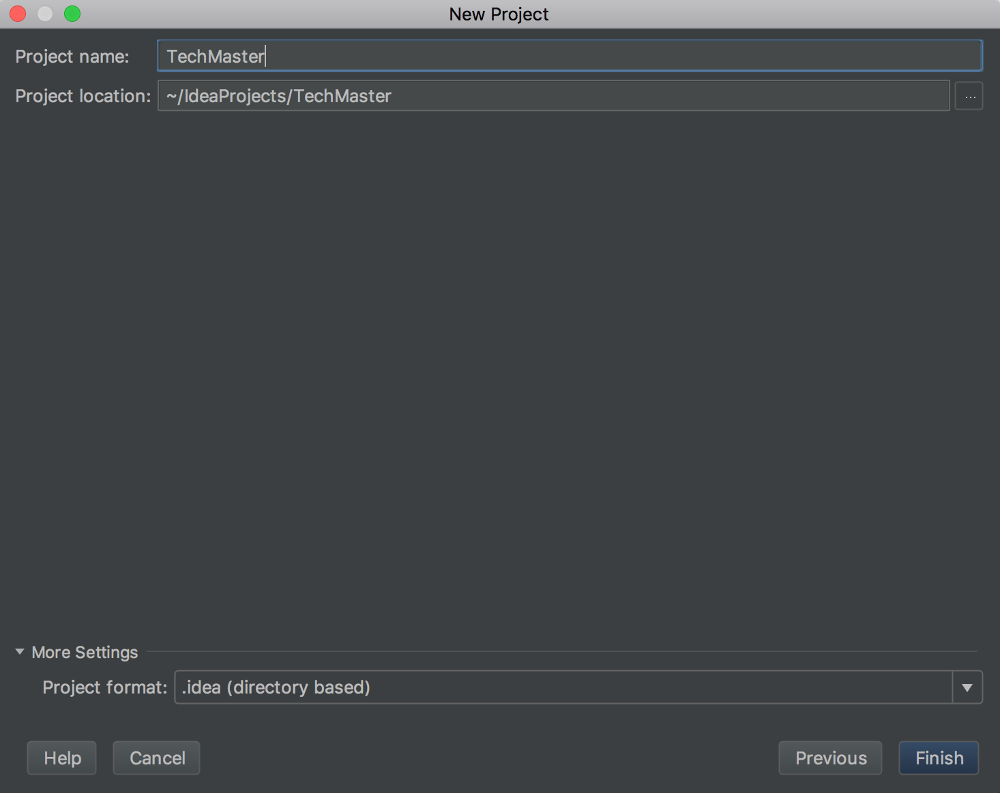
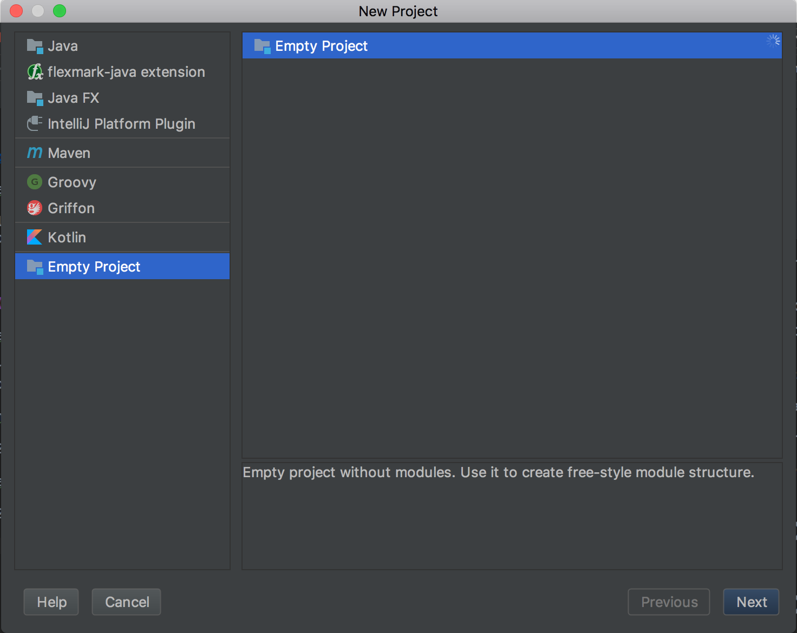
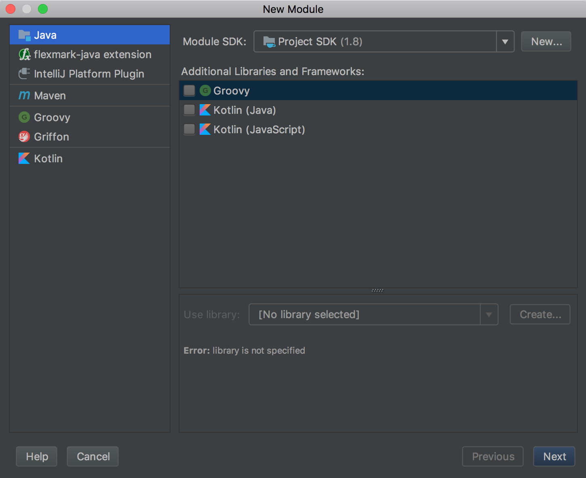
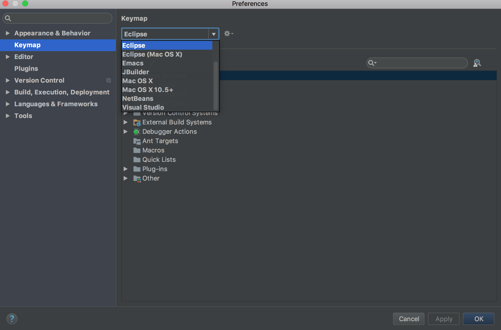

* Sử dụng IntelliJ
* Collections Framework trong *java.util*
* Ứng dụng *PhotoGallery*

## 1. Sử dụng IntelliJ

Lý do lựa chọn IntelliJ làm IDE cho khoá học

* Phần lớn các lập trình viên Java hàng đầu dùng IntelliJ
* Nhà phát triển JetBrains cung cấp rất nhiều IDE dựa trên bộ khung IntelliJ: *PyCharm, PHP Storm, CLion,...*
* Android Studio (do Google phát triển) cũng dựa trên bộ khung IntelliJ


### 1.1. Cài đặt IntelliJ

https://www.jetbrains.com/idea/download/

IntelliJ bao gồm 2 phiên bản:

* Ultimate
* Community

Tải bản *Community* và cài đặt như ứng dụng thông thường trên máy

__Chú ý:__

*Với Ubuntu thì chỉ cần unzip IntelliJ vào thư mục nào đó, ví dụ ~/java/intellij*

### 1.2. *Project* & *Module*



IntelliJ cho phép người dùng tổ chức project thông qua *Project* và *Module*

* Project: Khái niệm *logical* cho phép ghép các *application*, *library* có chung mục đích nào đó vào cùng một nhóm
* Module: Tương ứng 1-1 với *application*, *library*

Trong *screenshot* trên ta có *Project* lấy tên là **TechMaster** và 1 module **java-course** nằm trong **TechMaster**

*1.2.1. Nested modules*

IntelliJ cho phép tạo *Module* trong *Module*. Trong ví dụ trên ta có các module *session1, session2, session3, session4* nằm dưới module *java-course*

*1.2.2. Tạo **Project** cho khoá học*

Trong phần này các học viên sẽ được hướng dẫn:

* Tạo project **TechMaster** cho khoá học
* Tạo module **mine-sweeper**
* Tạo, biên dịch và chạy file .java có chứa hàm *main* trong **mine-sweeper**

*Các bước tạo project **TechMaster***

1. Từ main menu chọn *File->New->Project*

2. Chọn *Project Name* và *Project Location* như trong hình, click *Next*



3. Chọn *Empty Project* như trong hình và click *Next*




*Các bước tạo module **mine-sweeper***

1. Từ main menu chọn *File->New->Module..* và chọn *Java* rồi click *Next*



2. Điền các thông số như dưới đây rồi click *Finished*

* Module Name: *mine-sweeper*
* Content Root: *~/java/TechMaster/mine-sweeper*
* Module File Location: *~/java/TechMaster/mine-sweeper*

__Chú ý:__

*Module File Location là thư mục chứa mã nguồn của module, thư mục này **KHÔNG NÊN** để bên dưới thư mục project location. Trong khoá học này, các học viên được yêu cầu tạo các module nằm dưới ~/java/TechMaster/*

*Các bước tạo, biên dịch và chạy *MineSweeper.java* trong module *mine-sweeper**

1. Click chuột phải vào thư mục *src* trong module *mine-sweeper* và chọn *New->Package*
2. Điền vào popup tên package là *com.techmaster.minesweeper*
3. Click chuột phải vào package *com.techmaster.minesweeper* mới tạo và chọn *New->Java Class*
4. Điền vào popup tên class là *MineSweeper*
5. Tạo hàm *main* trong class mới tạo
6. Click chuột phải vào class *MineSweeper* và chọn *Run 'MineSweeper.main()'*


__Bài tập 1:__

*Tạo module **photo-gallery** trong ~/java/TechMaster, sẽ được dùng trong bài tập về ứng dụng PhotoGallery dưới đây*

### 1.3. Cài đặt *Keymap*




Khi làm việc với IntelliJ thì lập trình viên cần sử dụng một số phím tắt hỗ trợ việc đọc code source. Các phím tắt được cấu hình trong *Keymap* của IntelliJ và có một số lựa chọn default. Một trong các lựa chọn
default là *Eclipse* keymap. Để chọn cấu hình *Eclipse* cho keymap, ta làm như sau:

1. Từ main menu, chọn IntelliJ->Preferences->Keymap (hoặc IntelliJ->Settings->Keymap trên Windows, Linux)
2. Chọn *Eclipse* như trong hình trên và click *Apply*


## 2. *Collections Framework* trong *java.util*


Ở các bài học trước, ta đã học cấu trúc *array* cho phép lưu một nhóm các phần tử có cùng thuộc tính. Tuy nhiên cấu trúc *array* có một số hạn chế sau

* Không thể thay đổi kích thước của *array*
* Chỉ có thể access vào *array* thông qua *index*
* Không có sẵn các *method* hỗ trợ việc sắp xếp, thêm, bớt phần tử

Ví dụ:

Rất khó có thể dùng *array* đơn thuần để mô tả các bệnh nhân xếp hàng chờ khám bệnh do số lượng cũng như vị trí các bệnh nhân đợi trong hàng thay đổi liên tục.

### 2.1. Cấu trúc *list* và *map*

* *list*: Cấu trúc cho phép lưu trữ nhiều phần tử chung tính chất nào đó
* *map*: Cấu trúc cho phép lưu trữ danh sách các cặp <key, value>

Ví dụ:

1. *list* các bệnh nhân xếp hàng chờ khám
2. *map* danh sách tên nhân viên -> email

```java
import java.util.List;
import java.util.ArrayList;

public ListMaster{

  public static void main(String[] args){
     List<String> names = new ArrayList<>();

     names.add("Nam");
     names.add("Viet");
     names.add("Ha");

     System.out.println(names.get(0));
     System.out.println(names.get(1));
     System.out.println(names.get(2));
  }
}
```

```java
import java.util.Map;
import java.util.HashMap;

public MapMaster{

  public static void main(String[] args){
     Map<String, String> staffs = new HashMap<>();

     staffs.put("Nam", "nvnam@gmail.com");
     staffs.put("Viet", "tvviet@gmail.com");
     staffs.put("Ha", "bvha@gmail.com");
     System.out.println(names.get("Nam"));
     System.out.println(names.get("Viet"));
     System.out.println(names.get("Ha"));
  }
}
```

__Bài tập 2:__

*Tạo IntelliJ module **session4** và chạy 2 class MapMaster.java, ListMaster.java trên IntelliJ*

### 2.2 *Collection Framework*


*Collection Framework* là một phần của thư viện Java Core, cung cấp *công cụ mạnh* để làm việc với một số cấu trúc dữ liệu căn bản như

* *array*
* *list*
* *map*
* *queue*
* *stack*

Toàn bộ *Collections Framework* được tổ chức trong package **java.util**

https://docs.oracle.com/javase/8/docs/api/java/util/package-summary.html

Khoá học sẽ tập trung vào 2 kiểu dữ liệu được dùng phổ biến nhất trong lập trình nói chung là *list* và *map*

* https://docs.oracle.com/javase/8/docs/api/java/util/List.html
* https://docs.oracle.com/javase/8/docs/api/java/util/Map.html

__Bài tập 3:__

*Thêm 5 phần tử vào trong list trong ListMaster.java, in ra màn hình số phần tử có trong list*

__Bài tập 4:__

*Sắp xếp lại các phần tử trong ListMaster.java theo thứ tự alphabet, in ra màn hình*

__Chú ý:__

*Có thể dùng java.util.Collections.sort() để làm bài tập 4*

https://docs.oracle.com/javase/8/docs/api/java/util/Collections.html#sort-java.util.List-

## 3. Ứng dụng *PhotoGallery*