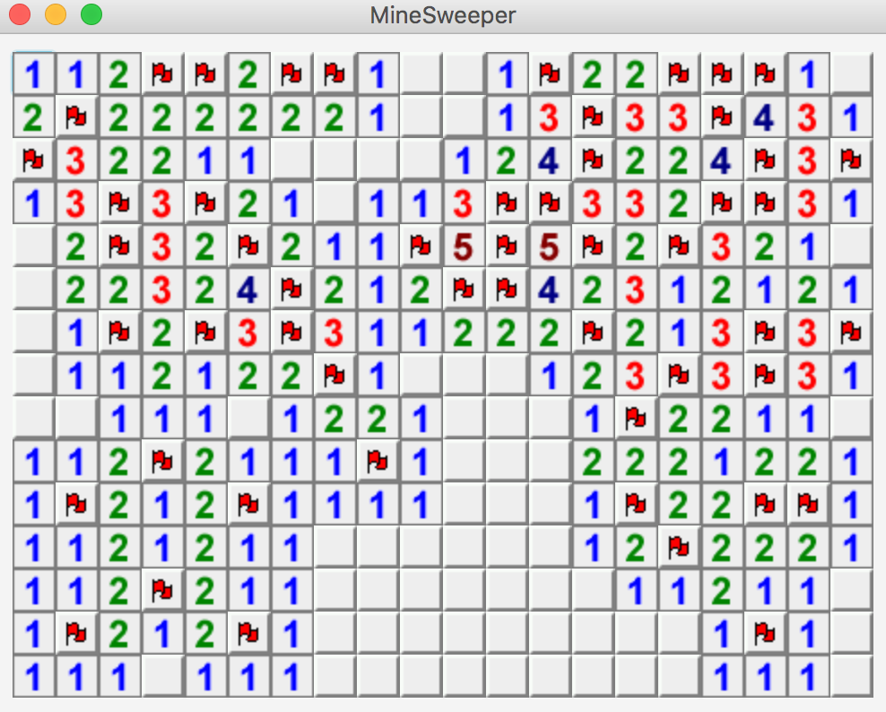
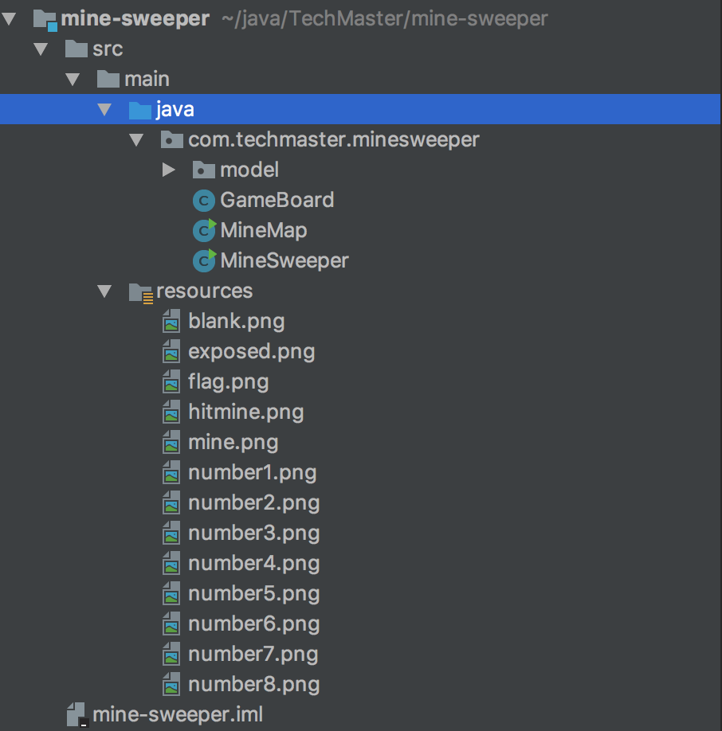
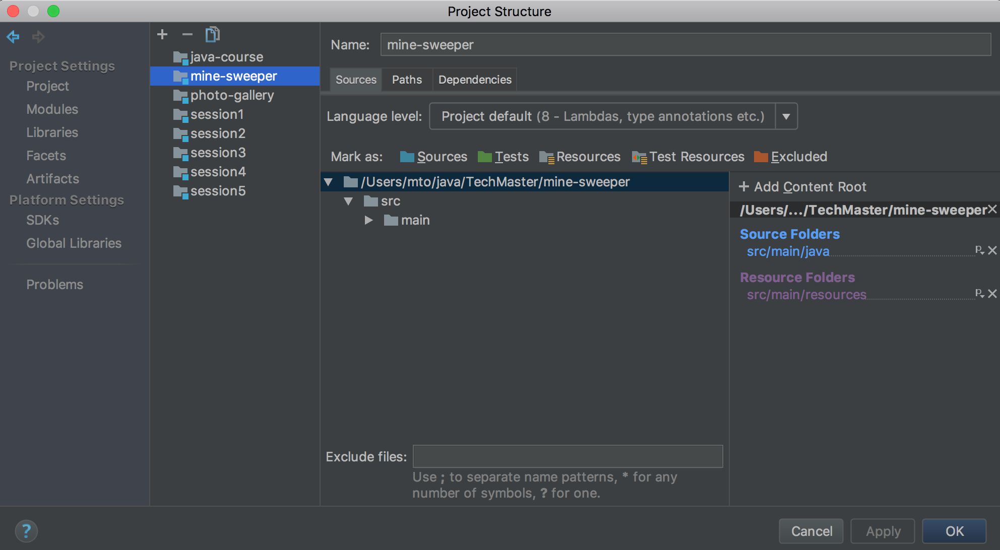

* Class & Inheritance
* Sử dụng *Git* & *GitHub*
* Lập trình game dò mìn

## 1. Class & Inheritance

Trước hết, ta hãy xét ví dụ cần phát triển ứng dụng hỗ trợ kết nối giữa bệnh nhân, bác sỹ và điều dưỡng viên. Một cách tự nhiên thì ta có thể thấy ứng dụng này sẽ cần các *class* cơ bản sau

* Patient: Mô phỏng bệnh nhân
* Doctor: Mô phỏng bác sỹ
* Nurse: Mô phỏng y tá

Có thể thấy rằng *Patient, Doctor, Nurse* sẽ chứa một số *field* giống nhau như tên, tuổi và nếu định nghĩa 3 *class* này một cách rời rạc thì các phần thông tin giống nhau đó sẽ bị lặp lại

### 1.1. Subclass

Giải pháp cho vấn đề các *field, method* giống nhau bị lặp lại trong nhiều *class*:

1. Tạo *class* **Person** chứa khai báo của các *field, method* chung

```java
public class Person{

    protected String firstName;

    protected String lastName;

    protected int age;

    public String getFullname(){
        return "" + firstName + " " + lastName;
    }

    public int getAge(){
      return age;
    }
}
```

2. Dùng cấu trúc sau để Doctor, Patient, Nurse thừa kế *field, method* trong Person

```java
public class Doctor extends Person {

}

public class Patient extends Person {

}

public class Nurse extends Person {

}
```

* *Doctor, Patient, Nurse* được gọi là các **subclass** của *Person*
* *Doctor, Patient, Nurse* thừa kế các *field, method* được khai báo trong *Person*


__Bài tập 1:__

*Tạo các class Person, Doctor, Patient, Nurse như trên trong module **session5** và tạo các hàm main trong mỗi class sử dụng các method khai báo trong class Person*

### 1.2. *java.lang.Object*


Trong Java có class đặc biệt là *java.lang.Object*. Mọi class khai báo trong Java đều nhận *java.lang.Object* là *ancestor*

Với vị trí đặc biệt của *java.lang.Object* trong Class Hierachy thì mỗi class trong Java sẽ kế thừa các method sau từ *java.lang.Object*

```java
public String toString();

public boolean equals(Object obj);

public native int hashCode();

public final native void wait();

public final native void notify();

public final native void notifyAll();

public void finalize();
```

__Chú ý:__

Trong các dòng code làm nhiệm vụ in ra màn hình hoặc '+' trên String sau đây thì method *toString* trên *obj* sẽ được gọi

```java
A obj = new A();

System.out.println(obj);

String s = "abc " + obj;
```

### 1.3. Method overriding

```java
public class Doctor extends Person {

  @Override
  public String getFullname(){
      //System.out.println(super.getFullname());

  }
}
```

__Bài tập 2:__

*Implement lại method getFullname trong class Doctor, trả về giá trị gồm chuỗi "Doctor: " + firstName + lastName, sau đó chạy hàm main trong class Doctor*


Ta có các khái niệm *downcasting* và *upcasting* khi call method được implement trong cả class và subclass

* *Downcasting*: Method khai báo trong subclass được gọi. Trong Java thì *downcasting* luôn được thực thi khi call method
* *Upcasting*: Method khai báo trong parent class được gọi. Từ khoá **super** cho phép thực thi *upcasting* khi call method


### 1.4. *subclass* & Collections Framework


```java
List<E> l = new ArrayList<E>();

Map<K,V> m = new HashMap<K, V>();
```

Trong bài học trước, ta đã được giới thiệu qua về ý nghĩa của các tham số *E, K, V* (Java Generics sẽ được học vào buổi học thứ 10)

* E: **l** có thể chứa bất kỳ *object* nào của class E
* K, V: **m** có thể chứa bất kỳ cặp *kobject, vobject* nào lần lượt thuộc kiểu K, V

Với khái niệm *subclass* thì khẳng định trên trở thành

* E: **l** có thể chứa bất kỳ *object* nào của class E hoặc subclass của E
* K, V: **m** có thể chứa bất kỳ cặp *kobject, vobject* nào lần lượt thuộc kiểu K, V hoặc subclass của K, V

### 1.5. Từ khoá *instanceof*

```java
Person p = ...;

if(p instanceof Doctor){
  System.out.println("Object p is instance of class Doctor");
}
```

* Từ khoá *instanceof* cho ta kiểm tra xem một *object* có là instance của một class nào đó không

__Bài tập 3:__

*Tạo class Hospital.java và hoàn thiện hàm main theo yêu cầu như dưới đây*

```java
import java.util.List;
import java.util.LinkedList;

public class Hospital{

  public static void main(String[] args){
    List<Person> people = new LinkedList<Person>();

    //TODO:
    //1. Thêm vào list people 1 doctors, 3 nurses và 5 patients
    //2. Dựa vào list people, hãy tính số lượng doctors, nurses, patients
  }

}
```
## 2. Sử dụng *Git* & *GitHub*


* Git: Công cụ versionning
* GitHub: Dịch vụ *cloud* cho Git

### 2.1. Cài đặt SSH key

GitHub cho phép xác thực thiết bị (dùng để truy cập vào tài khoản GitHub) thông qua SSH key. Việc xác thực thông qua SSH key sẽ giúp lập trình viên không phải *authenticate* mỗi khi tương tác với GitHub

https://help.github.com/articles/adding-a-new-ssh-key-to-your-github-account/

### 2.3. Tạo repository *mine-sweeper*

1. Tạo repository *mine-sweeper* từ giao diện của GitHub

https://help.github.com/articles/create-a-repo/

2. Tạo repository *mine-sweeper* trên local environment

```shell
cd ~/java/TechMaster/mine-sweeper

git init

git remote add origin git@github.com:{GIT_ACCOUNT_NAME}/mine-sweeper.git
```

__Bài tập 4:__

*Tạo repository theo hướng dẫn trong mục 2.3*

### 2.3. Gitk


* Công cụ cho phép view nhanh các commits trong repository thông qua command

```shell
gitk
```

## 3. Lập trình game dò mìn



Các học viên được yêu cầu hoàn thiện game dò mìn *mine-sweeper* trong **4 buổi học** + **thời gian làm việc ở nhà**

Các kiến thức chính để hoàn thiện game dò mìn bao gồm:

* *class* & *inheritance*
* *array* & Collections Framework
* Lập trình giao diện với *JavaFX*
* Làm việc với IntelliJ & GitHub

### 3.1. Bóc tách chương trình

Cấu trúc game dò mìn bao gồm:

* Một bảng vuông lớn chứa các ô vuông nhỏ
* Các ô vuông nhỏ có thể là ô trống, ô có mìn, ô chứa số
* Các ô vuông nhỏ được khởi tạo *ngẫu nhiên* lúc bắt đầu game
* Giao diện đồ hoạ hiển thị các ô vuông nhỏ và nhận tương tác từ người chơi (mouse clicks)

Do đó, ta cần các class sau cho bộ khung của game:

1. *MineCell, EmptyCell, NumberCell*: class dùng để biểu diễn các ô vuông nhỏ
2. *MineMap*: class khởi tạo *ngẫu nhiên* dữ liệu ban đầu của game
3. *GameBoard*: class làm công việc hiển thị giao diện đồ hoạ (dùng JavaFX)
4. *MineSweeper*: class chứa hàm *main* chính để chạy ứng dụng

### 3.1. Cấu trúc thư mục trong *mine-sweeper* module

Trong buổi học trước, ta đã tạo IntelliJ module *mine-sweeper* với lựa chọn *Java module*. Cấu trúc thư mục mặc định của *Java module* là có *src* trực tiếp chứa mã nguồn.

Tuy nhiên, cấu trúc thư mục mặc định này có các hạn chế sau:

* Không tách rời thư mục chứa Java source code với các resource khác
* Không giống với cấu trúc thư mục mặc định của *Maven module* được sử dụng trong hầu hết các dự án Java trong thực tế.

Do đó, ta cần chỉnh sửa lại cấu trúc thư mục của *mine-sweeper* như sau

* src/main/java: Chứa mã nguồn Java
* src/main/resources: Chứa các file resources của chương trình
* src/test/java: Chứa mã nguồn cho unit test
* src/test/resources: Chứa các file resources dùng cho unit test



Để chỉnh sửa cấu trúc thư mục trong module thì ta cần click vào *File->Project Structure* trên main menu, sau đó thao tác trên giao diện sau



### 3.2. *class* & *inheritance*

```java

```
### 3.2. Tạo dữ liệu ban đầu

```java
public class MineMap{

    private Cell[][] cells;

    public MineMap(int nRow, int nCol, float mineProb){
        //mineProb: Xác suất để một ô có mìn

    }
}
```


