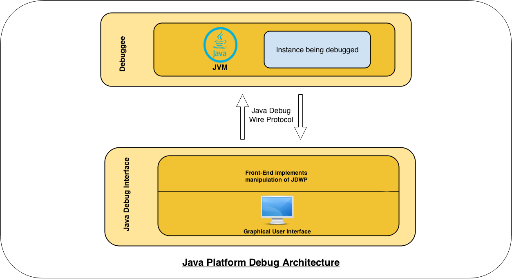

* Debug trong Java
* Lập trình giao diện với JavaFX
* Lập trình game dò mìn

## 1. Debug trong Java

*Debug*: Phương pháp *nội soi* tiến trình chạy của chương trình

* Cho phép **treo tạm thời** chương trình ở các **vị trí** mong muốn
* Cho phép lấy thông tin chi tiết và điều khiển tiến trình chạy của chương trình khi **treo tạm thời**

### 1.1. Debug với IntelliJ


Các bước để debug chương trình Java start từ 1 class có chứa hàm *main*:

1. Chọn *breakpoint* (**vị trí** chương trình sẽ treo tạm thời)
2. Click chuột phải vào class và click *Debug* trong contexttual menu


### 1.2. Debug view trong IntelliJ


Debug view trong Java chứa 4 widget chính sau:


|Vị trí|Hiển thị|
|---|---|
|NW|Cấu trúc thư mục, package của module|
|NE|File mã nguồn ứng với **vị trí** hiện tại của chương trình|
|SW|Danh sách các **thread** trong JVM, **method call stack** và các nút điều khiển|
|SE|Danh sách và thông tin chi tiết các **variables** liên quan đến **vị trí** hiện tại của chương trình|

__Bài tập 1:__

*Debug thử các ứng dụng đã làm trong các buổi học trước như **photo-gallery, MineMap***

### 1.3. Cơ chế hoạt động của Java Debugger





1. JVM kích hoạt *JDPA* agent thông qua option sau

```shell
-agentlib:jdwp=transport=dt_socket,server=y,suspend=n
```

2. Debug tool (ex: debug tool trong IntelliJ) kết nối với *JDPA* agent trong JVM chạy chương trình cần debug


__Chú ý:__

*Khi ta chạy debug từ IntelliJ thì về bản chất chương trình sẽ được chạy với JVM options như trên để kích hoạt *JDPA* agent*

## 2. Lập trình giao diện với JavaFX

## 3. Lập trình game dò mìn

Các học viên được yêu cầu sử dụng **GridPane** layout trong JavaFX để hiện thị các ô vuông được khởi tạo trong class **MineMap** trên giao diện đồ hoạ


### 3.1. Tạo JavaFX application

Như ta đã biết thì class chứa hàm *main* chính của ứng dụng JavaFX phải kế thừa từ class *javafx.application.Application*. Do đó class *MineSweeper* cần được chỉnh sửa để tuân theo cấu trúc này

```
public class MineSweeper extends Application{


      @Override
      public void start(Stage primaryStage) throws Exception {
        //Code initializing app
      }

      public static void main(String[] args) {
          launch(args);
      }

}
```

__Bài tập 5:__

*Sửa lại class **MineSweeper** để có thể chạy được ứng dụng với JavaFX*

### 3.2. Các file resource

Để hiển thị được các biểu tượng: *quả mìn, số, lá cờ,...* trên giao diện đồ hoạ thì ta cần có các file ảnh tương ứng

__Bài tập 6:__

*Tải các file ảnh từ link sau về thư mục **src/main/resources** trong module **mine-sweeper***

https://github.com/mto/mine-sweeper/tree/master/src/main/resources

### 3.3. Hoàn thiện class GameBoard.java

Như đã đề cập ở bài học trước, class *GameBoard* sẽ làm các nhiệm vụ liên quan đến JavaFX, cụ thể là tạo GridPane với các icon bên trong tuỳ theo dữ liệu ban đầu được sinh ra *ngẫu nhiên* bởi **MineMap**

```java
package com.techmaster.minesweeper;

import com.techmaster.minesweeper.model.Cell;
import com.techmaster.minesweeper.model.EmptyCell;
import com.techmaster.minesweeper.model.MineCell;
import com.techmaster.minesweeper.model.NumberCell;
import javafx.geometry.Insets;
import javafx.scene.control.Button;
import javafx.scene.image.Image;
import javafx.scene.image.ImageView;
import javafx.scene.layout.GridPane;

import java.util.HashMap;
import java.util.Map;

/**
 * @author <a href="hoang281283@gmail.com">Minh Hoang TO</a>
 * @date: 8/12/17
 */
public class GameBoard {

    private final MineMap mineMap;

    GridPane grid;

    private Map<String, Image> loadedRes;

    public GameBoard(int nRow, int nCol, float mineProb) {
        mineMap = new MineMap(nRow, nCol, mineProb);
        grid = new GridPane();
        loadedRes = new HashMap<>();

        initGrid(nRow, nCol);
    }

    private void initGrid(int nRow, int nCol) {
        for (int i = 0; i < nRow; i++)
            for (int j = 0; j < nCol; j++) {
                //TODO:
                //1. Dùng hàm getImage để lấy ra Image tương ứng với ô ở vị trí (i,j)
                //2. Tạo ImageView (javafx.scene.image.ImageView) từ Image lấy được
                //3. Tạo Button (javafx.scene.control.Button) từ ImageView
                //4. Thêm instance của Button vừa tạo vào vị trí (i,j) trong object 'grid'
            }
    }

    private Image getImage(Cell c) {
        String resName = "blank.png";

        //TODO: Thay đổi giá trị của resName tuỳ theo kiểu của 'c'

        Image res = loadedRes.get(resName);
        if (res == null) {
            res = new Image(Thread.currentThread().getContextClassLoader().getResourceAsStream(resName));
            loadedRes.put(resName, res);
        }

        return res;
    }
}

```

__Bài tập 7:__

*Tạo class GameBoard trong cùng package với MineSweeper và hoàn thiện các phần TODO*

__Bài tập 8:__

*Hoàn thiện hàm **start** trong class **MineSweeper** như dưới đây và chạy hàm main trong **MineSweeper***

```java
    @Override
    public void start(Stage primaryStage) throws Exception {
        GameBoard gb = new GameBoard(15, 20, 0.15f);
        gb.grid.setPadding(new Insets(10, 10, 10, 10));

        BorderPane bdp = new BorderPane();
        bdp.setCenter(gb.grid);

        Scene scene = new Scene(bdp);

        primaryStage.setTitle("MineSweeper");
        primaryStage.setScene(scene);
        primaryStage.show();
    }
```