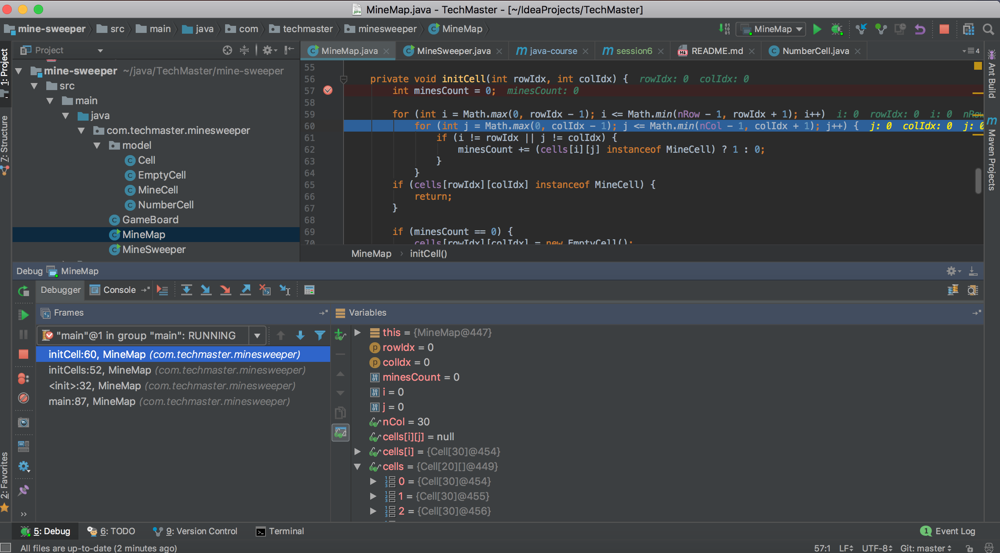

* Debug trong Java
* Lập trình giao diện với JavaFX
* Lập trình game dò mìn

## 1. Debug trong Java

*Debug*: Phương pháp *nội soi* tiến trình chạy của chương trình

* Cho phép **treo tạm thời** chương trình ở các **vị trí** mong muốn
* Cho phép lấy thông tin chi tiết và điều khiển tiến trình chạy của chương trình khi **treo tạm thời**

### 1.1. Debug với IntelliJ


Các bước để debug chương trình Java start từ 1 class có chứa hàm *main*:

1. Chọn *breakpoint* (**vị trí** chương trình sẽ treo tạm thời)
2. Click chuột phải vào class và click *Debug* trong contexttual menu


### 1.2. Debug view trong IntelliJ



Debug view trong Java chứa 4 widget chính sau:


|Vị trí|Hiển thị|
|---|---|
|NW|Cấu trúc thư mục, package của module|
|NE|File mã nguồn ứng với **vị trí** hiện tại của chương trình|
|SW|Danh sách các **thread** trong JVM, **method call stack** và các nút điều khiển|
|SE|Danh sách và thông tin chi tiết các **variables** liên quan đến **vị trí** hiện tại của chương trình|

__Bài tập 1:__

*Debug thử các ứng dụng đã làm trong các buổi học trước như **photo-gallery, MineMap***

### 1.3. Cơ chế hoạt động của Java Debugger


1. JVM kích hoạt *JDPA* agent thông qua option sau

```shell
-agentlib:jdwp=transport=dt_socket,server=y,suspend=n
```

2. Debug tool (ex: debug tool trong IntelliJ) kết nối với *JDPA* agent trong JVM chạy chương trình cần debug


__Chú ý:__

*Khi ta chạy debug từ IntelliJ thì về bản chất chương trình sẽ được chạy với JVM options như trên để kích hoạt *JDPA* agent*


