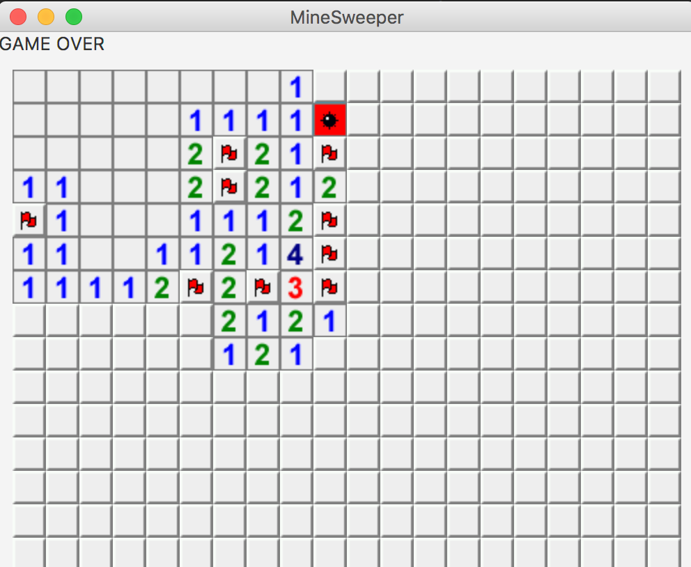
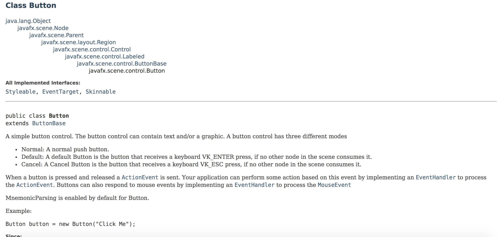

* Lập trình game dò mìn



Học viên được yêu cầu hoàn thiện phần tương tác người dùng trên giao diện của game dò mìn. Khi người dùng click vào một ô vuông con bất kỳ thì chương trình phải xử lý các tác vụ sau:

* Thay đổi giao diện của ô theo logic của game dò mìn
* Thay đổi trạng thái của trò chơi: *YOU WIN, GAME OVER*

### 1.1. *EventHandler* trong JavaFX


Một giao diện GUI từ lúc được *bật lên* cho đến khi được *đóng lại* thì sẽ liên tục phải xử lý các tương tác từ phía người dùng: *mouse click, nhấn phím, nhấn tổ hợp phím tắt,...*

* Ta gọi các tương tác người dùng này là các *event*
* Việc chương trình nhận và xử lý các *event* này được gọi là *event handling*

Class **JavaFXMaster** trong buổi học trước có chứa đoạn mã liên quan đến việc xử lý *event* click trên đối tượng *btn*

```java
        final Button btn = new Button("Click me!");
        btn.setOnAction(new EventHandler<ActionEvent>() {
            public void handle(ActionEvent event) {
                int n = counter.incrementAndGet();
                System.out.println("Button clicked " + n + "th");
            }
        });

```

Việc tạo *event handling* trong ứng dụng JavaFX bao gồm:

* Tạo subclass của **EventHandler** trong JavaFX
* Đăng ký *instance* của subclass này với UI component sẽ nhận tương tác người dùng


### 1.2. *CellClickListener*



Ý tưởng để implement *event handling* cho các ô vuông con trong bài toán game dò mìn bao gồm:

1. Tạo class **CellClickListener** kế thừa từ **EventHandler** và xử lý sự kiện click chuột
2. **Đăng ký** instance của **CellClickListener** với mỗi đối tượng **Button** được tạo ra trong class **GameBoard** thông qua đoạn mã như dưới đây

```java
                Button b = new Button("", imv);
                b.setPadding(new Insets(0, 0, 0, 0));
                b.setOnMouseClicked(new CellClickListener(...));
```


__Bài tập 1:__

*Tạo class **CellClickListener** trong package **com.techmaster.minesweeper.listener** với cấu trúc như dưới đây*

```java
public class CellClickListener implements EventHandler<MouseEvent> {

    @Override
    public void handle(MouseEvent e) {
        if (cell.isDiscovered()) {
            System.out.println("Cell discovered, do nothing");
        } else {
            MouseButton mb = e.getButton();
            if (mb == MouseButton.PRIMARY) {
                leftMouseClick();
            } else if (mb == MouseButton.SECONDARY) {
                rightMouseClick();
            } else {
                System.out.println("Clicked on " + mb);
            }
        }
    }

    private void leftMouseClick() {
        //TODO:
        //1. Đổi trạng thái 'discovered' cho ô được click
        //2. Đổi hình ảnh hiển thị trên ô đc click
        //3. Đổi trạng thái sang GAME OVER nếu ô được click là ô có mìn
    }

    private void rightMouseClick() {
        //TODO:
        //1. Hiển thị/Ẩn hình là cờ trên ô được click
        //2. Giảm/tăng số lượng qủa mìn nếu ô hiện tại là ô có mìn tuỳ theo trạng thái của ô khi click chuột phải
    }
}
```

### 1.3. Thêm *field, methods* trong **CellClickListener**

Trong quá trình xử lý sự kiện click chuột ta sẽ cần:

* Thay đổi ảnh hiển thị của ô vuông con
* Lấy thông tin toàn cục về game (ex: số quả mìn đã được cắm cờ,...)
* Thông tin về tính chất của ô vuông con (ex: ô mìn, ô số, trạng thái hiện tại của ô,...)

Do đó một cách tự nhiên thì từ class **CellClickListener** ta cần access vào các đối tượng của các class **Cell, GameBoard, ImageView**

```java
public class CellClickListener implements EventHandler<MouseEvent> {

    private Cell cell;

    private ImageView imv;

    private GameBoard gb;

    public CellClickListener(Cell _cell, ImageView _imv, GameBoard _gb) {
        this.cell = _cell;
        this.imv = _imv;
        this.gb = _gb;
    }
```

__Bài tập 2:__

*Thêm các **fields** và **constructor** như trên vào class **CellClickListener**, cập nhật đoạn code gọi constructor của **CellClickListener** trong **GameBoard***

### 1.4. Phiên bản *chơi được* của game dò mìn

__Bài tập 3:__

*Hoàn thiện các phần TODO trong class **CellClickListener***

__Chú ý:__

Để hoàn thiện bài tập 3 thì việc thiết kế một số method sau trong **GameBoard** sẽ đơn giản hoá vấn đề

```java
public Image loadImage(String resName)

public int getHiddenMines()

public void setHiddenMines(int hm)

public void gameOver()

public void winGame()
```

### 1.5. Cải tiến gamemmbmpg

__Bài tập 4:__

*Implement thêm tính năng cho phép khi người dùng click vào **EmptyCell** thì chương trình tự **khám phá** được tất cả các ô trống trong cùng cụm*