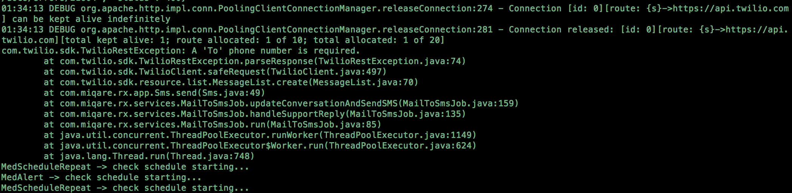
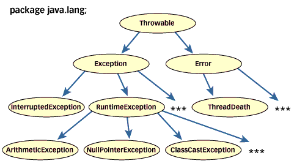
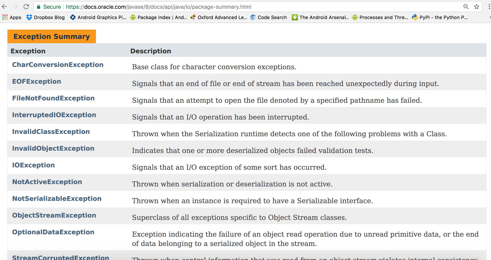
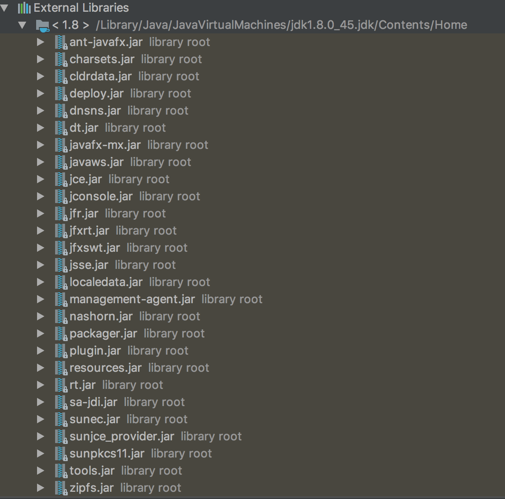
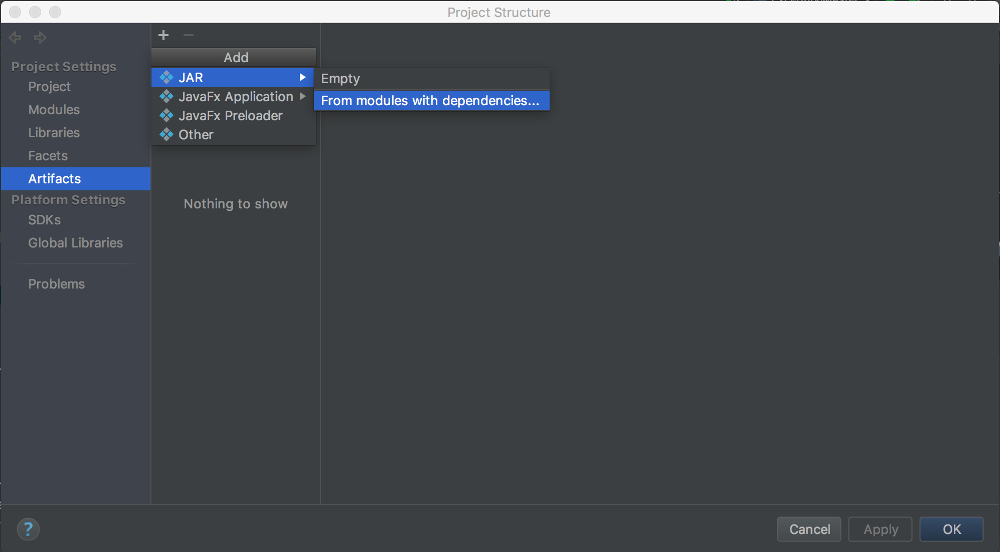
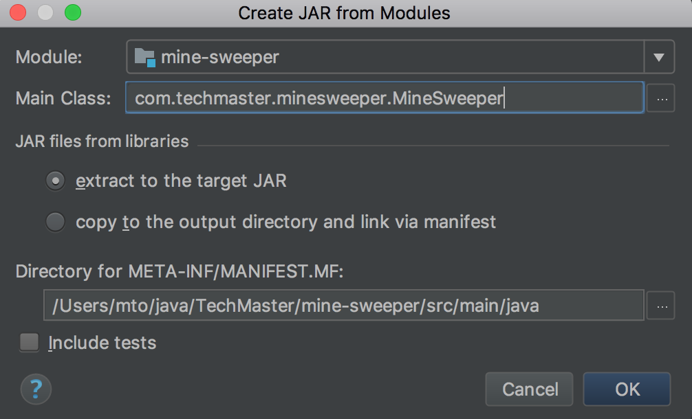

* *exception* trong Java
* Hoàn thiện & đóng gói game dò mìn

## 1. *exception* trong Java

### 1.1. *ExceptionMaster*


```java
public class ExceptionMaster{

  public static void main(String[] args){
     String[] names = new String[5];

     for(int i=0;i<names.length;i++){
        System.out.println(names[i].length());
     }
     System.out.println(names[5]);
  }

}
```

__Bài tập 1:__

*Tạo class ExceptionMaster như trên trong module session8 và chạy hàm main trong class này*

### 1.2. Khái niệm *exception*

*Lỗi xảy ra ở **runtime** làm thay đổi tiến trình chạy **được mong đợi***


Ví dụ:

* Thao tác trên object *null*
* Truy cập vào array với index vượt quá kích thước array
* Đọc file không tồn tại
* Login với password không hợp lệ

Hình dưới đây cho thấy *exception* trong một ứng dụng thực tế. Đoạn log trong hình cho thấy có *exception* khi chương trình gửi SMS nhưng tham số đầu vào không hợp lệ



### 1.3. Cơ chế xử lý *exception* trong JVM

```java
String u = "abc";
String pwd = "def";

String accessToken = LoginHelper.login(u, pwd); //exception here

List<Post> posts = postsOnWall(accessToken); //unexecuted instruction


```

Cơ chế JVM xử lý lỗi gặp ở **runtime**:

1. Dừng *luồng xử lý có chứa đoạn mã gặp lỗi* ở *vị trí* gặp lỗi
2. *throw* ra một instance của class *java.lang.Throwable*

https://docs.oracle.com/javase/8/docs/api/java/lang/Throwable.html

__Bài tập 2:__

*Debug class ExceptionMaster để xem luồng xử lý của JVM khi gặp lỗi*

### 1.4. *exception* trong Java Core

* Các class đại diện cho *exception* trong Java được tổ chức dưới cấu trúc *inheritance tree* như dưới đây



* Mỗi package trong Java Core luôn có mục *Exception Summary* chứa danh sách các *exception* có thể xảy ra khi sử dụng các tính năng cung cấp bởi package



### 1.5. *try/catch/finally*


Java cung cấp công cụ *try/catch* cho phép chủ động *lái* tiến trình của chương trình khi gặp lỗi.

#### 1.5.1. *try/catch*

```java
try{

   //DO SOMETHING

}catch(Exception ex){

  ex.printStackTrace();

  //DO SOMETHING IN CASE OF EXCEPTION
}
```

__Bài tập 3:__

*Thêm block try/catch vào vị trí thích hợp trong ExceptionMaster sao cho chương trình chạy qua toàn bộ vòng lặp*

#### 1.5.2. *try/catch/finally*

```java
try{

   //DO SOMETHING

}catch(Exception ex){

  ex.printStackTrace();

  //DO SOMETHING IN CASE OF EXCEPTION
}finally{

 //SOMETHING THAT MUST BE EXECUTED
}
```

__Bài tập 4:__

*Thêm block try/catch/finally vào ExceptionMaster*

## 1.6. *throw*

```java
try{

String accessToken = LoginHelper.login(username, password);

}catch(InvalidPasswordException ex){

  showLoginError();
}
```

Ngoài vai trò báo lỗi thì *exception* còn được sử dụng như một công cụ (kết hợp với *try/catch*) để xây dựng luồng xử lý của chương trình. Do đó trong nhiều trường hợp ta **cần chủ động tạo ra exception**

```java
public class LoginHelper{

public static String login(String username, String password){

if(!validCredential(username, password)){
    throw new InvalidPasswordException();
}
}


}
```


Java cung cấp từ khoá *throw* cho phép chủ động tạo ra *exception* với syntax như sau

```java
throw AN_INSTANCE_OF_CLASS_java_lang_Throwable
```

__Bài tập 5:__

*Tạo method trong class ExceptionMaster có sử dụng **throw***

## 2. Hoàn thiện & đóng gói game dò mìn


### 2.1. Java Archive



https://docs.oracle.com/javase/tutorial/deployment/jar/basicsindex.html

*.jar* (Java Archive) là cấu trúc file cho phép nhóm nhiều file *.class* trong cùng 1 file.

* Mọi thư viện hay ứng dụng Java sẽ bao gồm một hoặc nhiều file .jar
* Command để chạy hàm *main* trong *MineSweeper.class* trong file *mine-sweeper-1.0.jar*

```shell
java -jar ./mine-sweeper-1.0.jar com.techmaster.minesweeper.MineSweeper
```

### 2.2. Tạo file *mine-sweeper-1.0.jar*



Để generate ra file .jar tương ứng với module *mine-sweeper* ta cần làm các bước sau:

* Chọn File -> Project Structure -> Project Settings -> Artifacts
* Chọn *From module with dependencies* như trong hình trên
* Điền các thông số trong form như hình dưới, click OK



__Bài tập 6:__

*Hoàn thiện game dò mìn theo yêu cầu của bài học trước*

__Bài tập 7:__

*Generate ra file mine-sweeper-1.0.jar và chạy trên dòng lệnh*