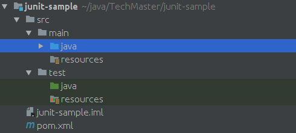

* Cài đặt & sử dụng Maven
* JUnit

## 1. Maven


Việc sử dụng tool UI của IntelliJ để build Java project có một số hạn chế sau:

* Khó quản lý *third-party dependencies* (project Java thực tế luôn có third-party dependencies)
* Không thực thi được việc build bằng *script*

Do vậy, trong các project Java thực tế ta sẽ cần dùng công cụ build mạnh hơn. Công cụ build phổ biến nhất cho Java project là Maven.


*Danh sách các công cụ build theo languages/platforms*

|Language/Platform|Build tool|Config file|
|---|---|---|
|Java|Maven|pom.xml|
|Java|Ant|build.xml|
|Java|Gradle|build.gradle|
|Android|Gradle|build.gradle|
|Scala|Sbt|build.sbt|
|Python|Pip|requirements.txt|
|NodeJS|Npm|package.json|
|C/C++|Make|makefile|
|C++|Ninja|build.ninja|

### 1.1. Cài đặt Maven

https://maven.apache.org/install.html

__Bài tập 1:__

*Tải và cài đặt Maven vào dưới thư mục **~/java**, sau đó khai báo thư mục **bin** của Maven trong biến **PATH***

__Chú ý:__

Kiểm tra thành công bằng cách chạy câu lệnh sau trên terminal

```shell
mvn --version
```

### 1.2. Tạo Maven project

1. Tạo thư mục *junit-sample* trên terminal như sau

```shell
cd ~/java/TechMaster
mkdir junit-sample
```

2. Tạo file *pom.xml* trong *junit-sample* với nội dung như sau

```xml
<?xml version="1.0" encoding="UTF-8"?>
<project xmlns="http://maven.apache.org/POM/4.0.0"
         xmlns:xsi="http://www.w3.org/2001/XMLSchema-instance"
         xsi:schemaLocation="http://maven.apache.org/POM/4.0.0 http://maven.apache.org/xsd/maven-4.0.0.xsd">
    <modelVersion>4.0.0</modelVersion>

    <groupId>com.techmaster.javacourse</groupId>
    <artifactId>junit-sample</artifactId>
    <version>1.0-SNAPSHOT</version>
    <packaging>jar</packaging>

    <build>
        <plugins>
            <plugin>
                <groupId>org.apache.maven.plugins</groupId>
                <artifactId>maven-compiler-plugin</artifactId>
                <configuration>
                    <source>1.8</source>
                    <target>1.8</target>
                </configuration>
            </plugin>
        </plugins>
    </build>
</project>
```

3. Chạy lệnh build *junit-sample* trên terminal bằng command sau:

```shell
cd ~/java/TechMaster/junit-sample

mvn clean install
```

__Bài tập 2:__

*Chaỵ lần lượt các câu lệnh sau và chú ý các dòng log **Downloaded, Installed...** trên console của Maven*

```shell
mvn clean install
mvn clean test
```

### 1.3. Khai báo *third-party dependencies*

Project Maven khai báo *third-party dependencies* thông qua block *dependencies* trong file *pom.xml*

```xml
<?xml version="1.0" encoding="UTF-8"?>
<project xmlns="http://maven.apache.org/POM/4.0.0"
         xmlns:xsi="http://www.w3.org/2001/XMLSchema-instance"
         xsi:schemaLocation="http://maven.apache.org/POM/4.0.0 http://maven.apache.org/xsd/maven-4.0.0.xsd">
    <modelVersion>4.0.0</modelVersion>

    <groupId>com.techmaster.javacourse</groupId>
    <artifactId>junit-sample</artifactId>
    <version>1.0-SNAPSHOT</version>
    <packaging>jar</packaging>

    <dependencies>
        <dependency>
            <groupId>org.jsoup</groupId>
            <artifactId>jsoup</artifactId>
            <version>1.10.3</version>
        </dependency>

        <dependency>
            <groupId>junit</groupId>
            <artifactId>junit</artifactId>
            <version>4.12</version>
            <scope>test</scope>
        </dependency>
    </dependencies>

    <build>
        <plugins>
            <plugin>
                <groupId>org.apache.maven.plugins</groupId>
                <artifactId>maven-compiler-plugin</artifactId>
                <configuration>
                    <source>1.8</source>
                    <target>1.8</target>
                </configuration>
            </plugin>
        </plugins>
    </build>
</project>
```

__Bài tập 3:__

*Thêm vào file **pom.xml** block **dependencies** như trong hình trên và làm lại bài tập 2*

__Chú ý:__

**Các third-party dependencies trong khuôn khổ khóa học này sẽ được lấy từ trang MVNRepository**

https://mvnrepository.com/artifact/org.jsoup/jsoup/1.10.3


### 1.4. Import *junit-sample* vào IntelliJ

1. Chọn *File->New->Module from Existing Sources...*

2. Chọn file *pom.xml* trong *junit-sample* như trong hình dưới


3. Chọn *Next->Finish*

## 2. JUnit


Trong quá trình viết code cho một dự án phần mềm thì ta luôn có nhu cầu kiểm tra logic xử lý của từng phần nhỏ của chương trình. Các chương trình kiểm tra logic xử lý đó được gọi chung là các *unit test*

*unit test* có 2 vai trò chính sau trong dự án phần mềm:

* Kiểm tra logic xử lý của từng module
* Nhanh chóng phát hiện các lỗi xảy ra từ sự thay đổi trên các module khác (có thể do các lập trình viên khác phát triển)

JUnit là thư viện hỗ trợ viết *unit test* trong Java

### 2.1. Cấu trúc folder của *junit-sample*

Maven project tổ chức *code source* và *resources* vào các thư mục sau:

* src/main/java: Chứa mã nguồn Java
* src/main/resources: Chứa các file resources
* src/test/java: Chứa mã nguồn *unit test*
* src/test/resources: Chứa các file resources cho *unit test*

__Bài tập 4:__

*Tổ chức cấu trúc thư mục của **junit-sample** như sau*



### 2.2. *MathUtil.java* & *MathUtilTest.java*

__Bài tập 5:__

*Tạo các file **com.techmaster.junitsample.MathUtil.java** và **com.techmaster.junitsample.MathUtilTest.java** lần lượt nằm dưới **src/main/java** và **src/test/java** với nội dung sau đây*

```java
package com.techmaster.junitsample;

/**
 * @author <a href="hoang281283@gmail.com">Minh Hoang TO</a>
 * @date: 06/09/2017
 */
public class MathUtil {

    public int sumSquares(int n) {
        int sum = 0;
        for (int i = 1; i <= n; i++) {
            sum += i * i;
        }

        return sum;
    }

}
```

```java
package com.techmaster.junitsample;

import org.junit.Test;

import static org.junit.Assert.assertEquals;
import static org.junit.Assert.assertTrue;

/**
 * @author <a href="hoang281283@gmail.com">Minh Hoang TO</a>
 * @date: 06/09/2017
 */
public class MathUtilTest {

    @Test
    public void sumSquares() {
        MathUtil m = new MathUtil();

        assertEquals(14, m.sumSquares(3));
        assertTrue(m.sumSquares(3) != 13);
    }
}

```

*tiếp theo chạy lệnh sau trên terminal*

```shell
mvn clean test
```

## 2.3. Html parser với *jsoup*


Trong phần này, học viên được yêu cầu hoàn thiện class *HtmlParser*, sử dụng thư viện *jsoup* và cho phép bóc tách thông tin từ dữ liệu đầu vào có định dạnh HTML.

Việc sử dụng thư viện *jsoup* sẽ là kiến thức nền cho việc phát triển ứng dụng *vscrapper* trong các buổi học tới

https://jsoup.org/

__Bài tập 6:__

*Tạo các class HtmlParser, HtmlParserTest như dưới đây và hoàn thiện phần TODO, sau đó chạy test thông qua Maven từ terminal*

```java
package com.techmaster.junitsample;

import org.jsoup.Jsoup;
import org.jsoup.nodes.Document;

/**
 * @author <a href="hoang281283@gmail.com">Minh Hoang TO</a>
 * @date: 06/09/2017
 */
public class HtmlParser {

    private final Document htmlDoc;

    public HtmlParser(String htmlSrc){
        htmlDoc = Jsoup.parse(htmlSrc);
    }

    public int countTag(String tagName){
        //TODO: Count the number of tags (<a>, <div>,<src>,....)
        return 0;
    }

}
```

```java
package com.techmaster.junitsample;

import org.junit.Test;

/**
 * @author <a href="hoang281283@gmail.com">Minh Hoang TO</a>
 * @date: 06/09/2017
 */
public class HtmlParserTest {

    @Test
    public void countTag(){
        HtmlParser p = new HtmlParser("<html><head></head><body><div>abcdefgh</div><div>mnpqrs</div><br><br></body></html>");
        //TODO: Write more asserts with p
    }
}
```

__Bài tập 7:__

*Tìm hiểu thư viện **jsoup** và phát triển thêm các method, test unit tương ứng trong HtmlParser, HtmlParserTest*

https://jsoup.org/apidocs/